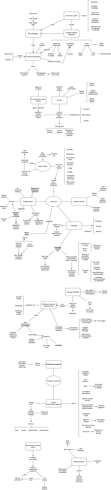

# Teaching as a Subversive Activity

## Info
- Type: book
- Authors:
  - Neil Postman
  - Charles Weingartner

## Category
- Philosophy
- Education
- Culture

## Structure
- Intro: problems, needs for new education
- Chap 1: critical thinking ability
- Chap 2: limitation & impact of current learning environment
- The inquiry method:
  - Chap 3: intro, metaphors to think about
  - Chap 4: relevant subject, student-centered env
  - Chap 5: question-based curriculum
  - Chap 6: new metaphor of the mind: as meaning making process
  - -> Chap 7: language-centered learning
- Chap 8: improving current teaching attitudes & training new teacher
- Chap 9: addressing discrimination in & structuring public schools
- Chap 10: media study
- Chap 11: examples of question-based & game-based curriculum
- Chap 12: concrete suggestions for current teachers
- Chap 12: restatement the importance of education for survival in a quickly changing world

## Style
- Expositional
- Contain lots of examples of new edu
- Lots of story telling as evidence

## Criticism
- Somewhat repetitive in several ideas
- The use of metaphors, analogies sometimes obscure the central point
- Single example is not that persuasive

## Takeaway
- Biases & limitations of my education & current education system
- Important of language edu
- Ideas for mentoring & coaching: question-based, let mentees think by themselves

## Main content
