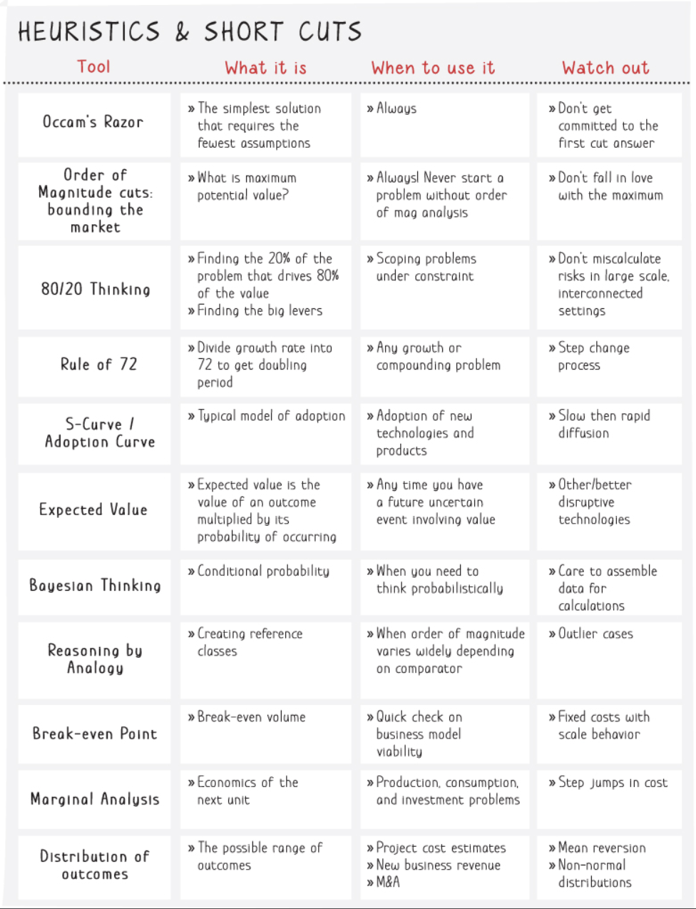
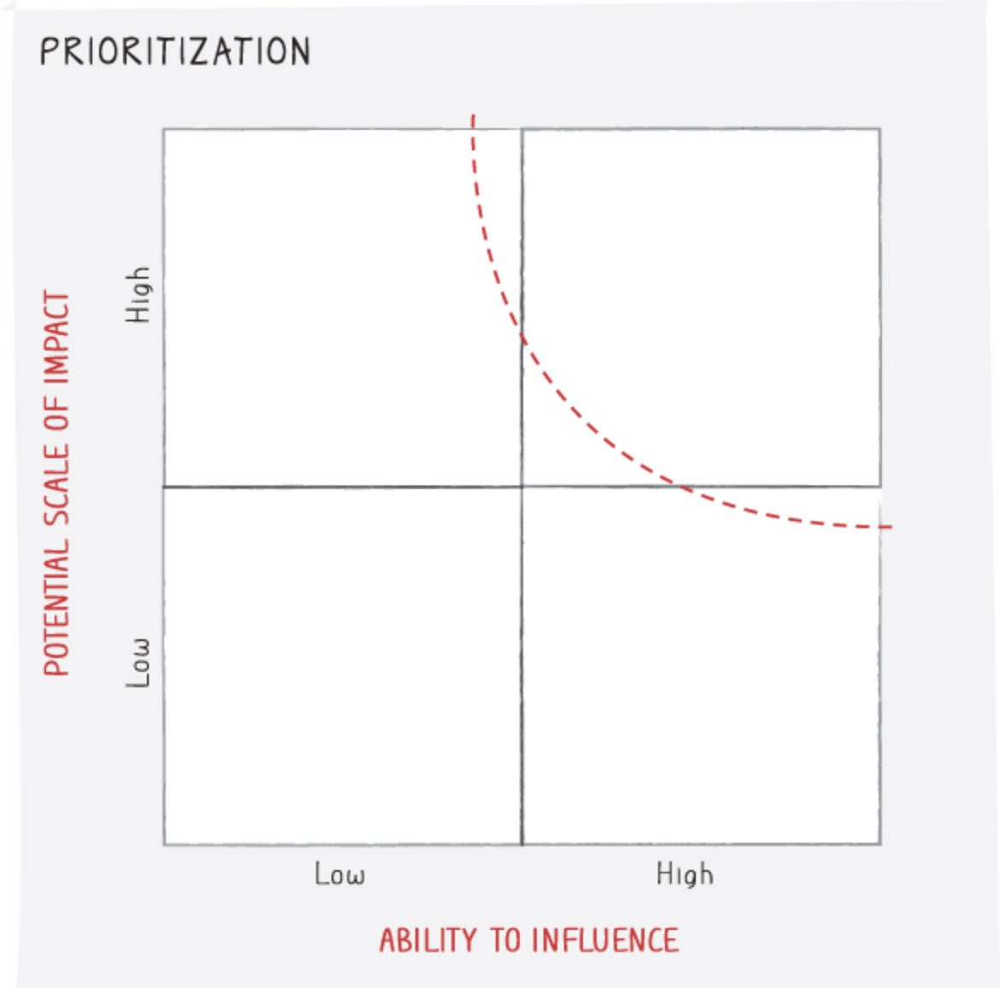

# Bulletproof problem solving

## Info
- Type: book
- Authors: Charles Conn, Robert McLean

## Category
- Practical

## Structure
- Intro: needs, goal, process intro
- Chap 1: iterative process & logic tree intro with examples
- Chap 2, 3, 4, 5, 6, 7: detailed process & best practices
- Chap 8: deal with highly uncertain, long-timeframe problems
- Chap 9: deal with wicked problems
- Chap 10: summary

## Style
- Diverse real-world examples
- Highly visual

## Criticism
- Use lots of buzzwords but keep claiming that the process is generally accessible
- Lots of knowledge required to choose the apt formula/tree
- Imp branches in problem breakdown are limited by what we know
- Basically just an introduction. Many techniques/knowledge/issues are not adequately dealt with.
- Work planning: too detailed, might cost too much time

## Takeaway
- Motivation to try out the process, esp problem breakdown using dif types of logic trees
- Some understanding of how consultant companies work
- Imp of visualization in understanding the problem & communicating result

## Main content

## Appendix
### Cleaving frames

### Top 10 heuristics

### Analysis sophisticated tools considerations

### Story telling

### Uncertainty

### Tools
- Cleaving frames
- Logic trees
- Cost-benefit analysis graph
- 
- 
- 
- 
- 