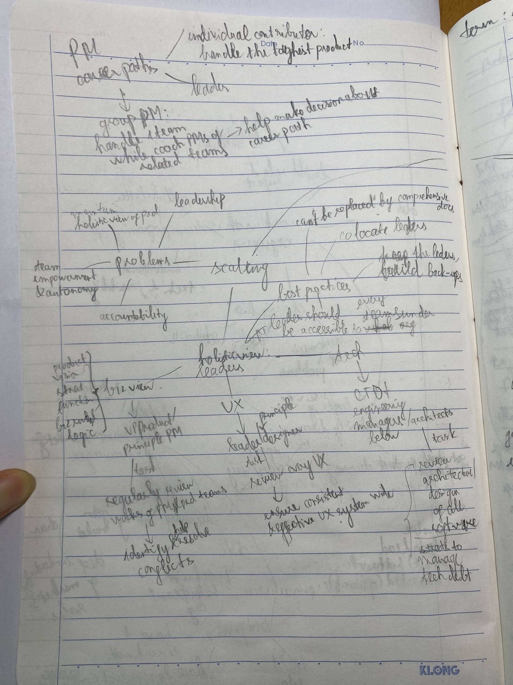

# Inspired

## Info
- Type: book
- Authors: Marty Cagan

## Category
- Product management
- Practical

## Style
- Short easy read chapters

## Criticism
- Shallow, self-help style. No back up evidence beside "it works".

## Takeaway
- Product practice & organization structure
- OKR system

## Main content

