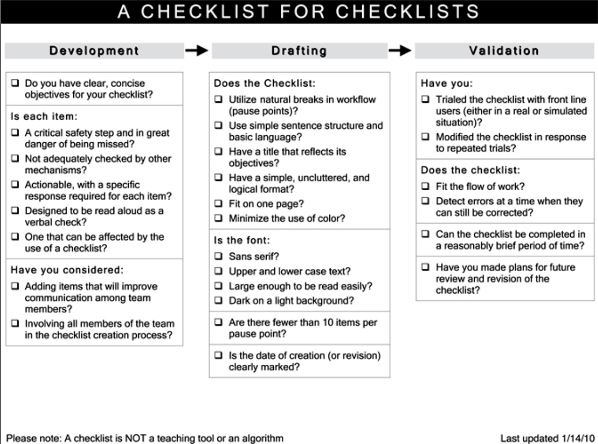

# The checklist manifesto

## Category
Practical, design, human error

## Structure
- Throughout the book: checklist usage in dif industries, including: medicine, aviation, construction, restaurant, investment
- Intro:
  - Causes of human failure
  - Problem of ineptitude. The need for a solution.
  - Intro checklist as a solution.
- Chap 1:
  - Complexity in:
    - Amount of knowledge
    - Difficulty in execution
  - Super-specialization as a solution to complexity in medicine: not adequate
- Chap 2:
  - Difficulty of complex task
  - -> Advs of checklist
  - Checklist in preventing line infection example:
    - Its success
    - Reasons for not adopting
    - How to make adoption easier
  - Raise the question: is checklist suitable for other cases?
- Chap 3:
  - 3 dif kinds of problems based on complexity
  - How construction field design checklist to deal with complex, unexpected problem: communication checklist
  - Why reliance on expertise of one leading authority wouldn't work
- Chap 4:
  - Idea of pushing power to periphery in complex situation
- Chap 5:
  - Importance of working effectively as a team. Step in cl to enhance teamwork.
  - Attempt of the author to use checklist to solve issues in surgery
- Chap 6:
  - Principles of making a good checklist
  - Dif between good and bad checklist
- Chap 7: improvement to the surgery checklist & its impact
- Chap 8:
  - Slow adoption in medicine & finance despite evidence of checklist effectiveness
  - Discussion of possible cause: popular idea of the competent
  - How to adjust the idea of the competent in modern era
  - Importance of discipline
  - Call to adopt a new culture of studying failures & incorporate result into checklists
  - Some summary
- Chap 9: author's own benefits from checklist

## Author problems & solutions
- Goal proposed by author: reduce failure rate when performing simple & complex tasks
- Means to achieve the goal: use checklist

## Presentation & style
- No index
- References: articles, papers & reports
- Book structure not provided in introduction
- Narrative style, with personal, medical & other examples/stories
- Provide figures to illustrate the point

## Terms
- 3 causes of human failures:
  - Necessary fallibility
  - Ignorance
  - Ineptitude
- 3 types of problems:
  - Simple
  - Complicated
  - Complex
- -> Complicated & complex problems are used interchangeably in the book & this summary
- Forcing function
- Pause point
- Do-confirm vs read-do checklist
- Hawthorne effect: effect is the result of being observed in a study
- Expectations in definitions of professionalism:
  - Selflessness
  - Skill
  - Trustworthiness
  - Discipline

## Arguments
### Introduction
- 3 causes of human failures:
  - Necessary fallibility: the task is beyond human capacity
  - When the task is within human capacity:
    - Ignorance: science has given us only a partial understanding of the world
    - Ineptitude: the knowledge exists, but we fail to apply it correctly
    - -> Make people emotional, angry
    - -> But usually happens despite great effort, not lack of it
- Over the last decades, due to development in science, knowledge & sophistication has increased dramatically in:
  - Breath quantity of knowledge -> difficulty of choosing the right solution
  - Difficulty of execution
- -> The balance has shifted toward ineptitude
- Traditional solution to ineptitude problem: accumulate more exp by training & practice
- -> The problem still persist despite increased, intense training
- -> Reason: volume & complexity of knowledge has exceeded individual ability to deliver its benefits correctly, safely & reliably
- Checklist as a new solution:
  - Build on exp & take adv of existing knowledge
  - Make up for inevitable human inadequacies

### 1. The problem of extreme complexity
- Modern medicine has shifted from one-pill-cures-all-illnesses model to an art of managing extreme complexity
- Current solution of medicine to handle complexity: super-specialization: split the tasks among various specialties. Advs:
  - Specialized knowledge
  - Experience with the particular task
- -> Steps are still missed, mistakes are still made

### 2. The checklist
- Difficulties experts have to faced in complex env:
  - Fallibility of human memory:
    - In mundane, routine matters under pressing events
    - In complex task
    - More severe in all-or-none process: missing one thing still leads to failure
  - Tendency to skip steps even if the step is remembered because certain steps don't always matter
- -> Checklist provide protection against such failures
- Advs of cl:
  - Remind & make explicit the necessary steps
  - Establish discipline & standard of higher performance
#### Additional info
- Checklist in preventing line infection:
  - Reasons for slow adoption despite initial impressive result:
    - Doctors offended by the suggestion to use cl
    - People doubt the initial evidence
    - People are too busy to have time to fill out the cl
  - How to make adoption easier:
    - Didn't force people to use: ask them to gather data first
    - Offer incentive
    - Hear the complaints & help solve problem (eg make sure the needed items are available)
- -> Might be isolated success since the process involved is not complex
- Other case study: procedure to rescue drowning victims: give checklist to people with least power in the whole process

### 3. The end of the master builder
- 3 types of problems:
  - Simple: just follow the defined recipe/procedure
  - -> Can be handled by forcing functions - straightforward solutions that force the necessary behavior (eg cl)
  - Complicated:
    - Can be broken down into series of simple problems
    - But no straightforward recipe
    - Usually require multiple people/teams & specialized expertise
    - Frequent unanticipated difficulties
  - -> Need timing & coordination
  - Complex:
    - Each problem is unique, hard to do trial and error & repeat previous success
    - Outcome is highly uncertain
  - -> Expertise/exp is valuable but not sufficient
- Goals when solving complicated/complex problem:
  - Make sure people get the basic steps right
  - Leave room for craft & judgement & ability to respond to unexpected difficulties
- Problem in medicine: while complexity overwhelms individual ability to master/deliver,
the one-coordinator model (master physician) is still being followed, to handle the nuances/unexpected problems
- -> Incompatible decisions & overlooked errors
- Construction schedule cl:
  - Schedule is a long cl, issued each week (or more frequently), consisting of many day cl
  - Critical items (blocking steps) are highlighted
  - Created separately for each different building
  - All teams/subfields are involved in cl creation & verification process
- How construction field deal with unexpected problems: use communication cl:
  - Specify communication tasks:
    - On date X
    - Regarding aspect/process Y
    - What info is required before the next steps could be proceeded
  - -> Making sure experts speak to each other
  - -> Believe in the wisdom of the group
  - Experts can make individual judgements, but have to do as part of a team:
    - Take others' concern into account
    - Reach agreement on the way forward
- => 2 set of checklists to deal with simple & complex problems

### 4. The idea
- Construction field's philosophy to deal with complex, non-routine problem:
  - Push decision-making power to the periphery, give people room to adapt based on their exp & expertise
  - Ensure they communicate with others & take responsibility
#### Additional info
- Walmart's response to hurricane story:
top managers set goal, measure progress & maintain communication line with employees
- Points from cl usage in restaurant industry:
  - Food recipe can be open for adjustment/improvement
  - Use of review cl in final step to ensure food quality

### 5. The first try
- Common obstacles to forming effective teams:
  - Side issue: authoritarian leader
  - Main issue: silent disengagement (eg that's not my problem)
  - -> Consequence of specialized technicians sticking narrowly to their domains
  - -> Need team members see their job not just as performing isolated set of tasks but also as helping the group get the best possible results
- Step in cl to enhance team work: introducing name & role. Effects:
  - Improve communication
  - Activate sense of participation, responsibility & willingness to speak up (eg note problems & offer solutions)

### 6. The checklist factory
- Construction cl vs surgery cl: timescale of project: months vs hours/minutes
- -> Need to consult aviation cl: same timescale
- Aviation checklists:
  - Very brief: few lines in big, clear font, in one page
  - 2 types:
    - Normal cls: only several cl, used for everyday operations
    - Non-normal cl: cover every conceivable emergency situation
- Bad cl:
  - Vague, imprecise
  - Too long:
    - Become a distraction
    - People start taking shortcuts
    - Steps get missed
  - Hard to use, impractical: not tested in real life situations
  - Treat people as dumb, specify every single step
  - -> Turn people brain off
- Limitation of cls: can't make anyone follow them
- -> Need to train people to follow cl by:
  - Make them recognize the fact that their memory & judgement are unreliable
  - Provide evidence that the cls work
- Do-confirm vs read-do cl:
  - Do-confirm:
    - Team members perform their jobs from memory & exp, often separately
    - Then pause to confirm that everything required was done
  - Read-do: ~recipe, people carry out the tasks as they check them off
- Rules of making good cls:
  - Define a clear pause point to use checklist, unless the moment is obvious (eg emergency)
  - Decide which type of cl to use: do-confirm or read-do
  - Keep it brief: 5-9 items (limit of working memory)
  - -> Focus on steps that are most dangerous to skip & sometimes still get overlooked
  - -> Omit steps (even critical ones) that are always performed
  - -> Try to pick steps using data
  - Wording:
    - Simple & exact
    - Use familiar language of the profession
  - Look:
    - Fit on one page
    - Free of clutter & unnecessary colors
    - Use both upper & lowercase text for ease of reading (eg sans serif type like Helvetica)
  - Test the cl in the real world, study the result/failure & make changes until it works consistently
  - Open to constant adjustments
  - -> Put a publication date on the cl
  - Allow institutions to make adjustments to fit the cls into their usual procedures
- Checklist of making checklist:
  - 
- Checklist in complex tasks:
  - Not a comprehensive how-to guides
  - Quick & simple tools to strengthen skills of professionals
- What usually happens when failures occur:
  - Not get investigated
  - Investigated:
    - Findings are presented in a course/seminar or in professional journal/textbook
    - Issue guidelines or declaration of standards
  - -> Incorporate the changes often take years
  - -> Reason for the delay: the necessary knowledge has not been translated into simple, usable & systematic form
  - -> Need to distill info into its practical essence

### 7. The test
- Who to start the checklist: not the main person performing the task:
  - He can be distracted by the task & liable to skip the cl
  - Disperse the responsibility
  - -> Everyone is responsible for the task & has power to question the process
- Written check marks are not needed when aiming for team conversation to review what is needed
- Difficulty of incorporating cl into the routine:
  - Team forget to carry out part of the cl
  - Difficult to adhere to due to social issue:
  people has to change style to huddle with everyone for a systematic run-through of the plans & possible issue
#### Additional info
- The surgery checklist:
  - Introduction:
    - Systematically by hospital leaders, in the form of presentation to everyone involved
    - -> As a first step towards cultural change (shift in authority, responsibility & expectations)
    - -> Make adoption easier for staff
    - Failure data is supplied to clarify the problem being addressed
    - Usage guideline via Youtube video
    - Introduce in just one operating room at first, to senior members to:
      - Adjust order & wording of the cl to suit the hospital's practices & terminology
      - Ensure the first group using the cl has seniority & patience to make the necessary modifications
    - Not force people who reject the cl to use it
    - -> Might make others refuse to participate
    - -> Present the cl simply as a tool to try
  - Result is observe for a short period: ~3 months after introduction
  - -> Ensure changes are consequence of the cl, not of other long-term, ongoing trends

#### 8. The hero in the age of checklists
- Opportunities to adopt checklist culture are evident in many fields, but cls are being resisted
- The checklist culture:
  - Embrace teamwork & discipline
  - Make new cls for specialized/emergency situations
  - Study pattern of failures, incorporate into checklist, track result & make adjustment
  - -> As a new alternative to the conventional way after an issue happened: work harder & try to clean up after
- Checklist doesn't enforce rigidity, mindless automation, but get the basic/routine stuff out of the way
- -> Can focus on the hard stuff
- Root cause of difficulty in adopting cl approach:
not laziness but the deeply held beliefs about how great people handle high-stake, complex situations:
  - Bold
  - Improvise, without protocols & checklists
- -> Need update to fit modern era
- Hero in modern era:
  - Able to adhere to vital procedures when it mattered most
  - Remain calm under pressure
  - Recognize when to improvise and when not
- Common expectations in definitions of professionalism:
  - Selflessness: accept responsibility for others, place their needs & concerns above our own
  - Skill: aim for excellence in knowledge & expertise
  - Trustworthiness: responsible in personal behavior toward our charges
- New expectation in aviation: discipline: in following prudent procedure & in functioning with others
- -> In contrast/outside with most professions' definition: usually value the star
- -> Discipline is what needed in complex situations, large enterprises/teams, huge amount of knowledge
- -> Have to work at, make it a norm, since it is not in human nature
- Technologies (eg computer) as an aid:
  - Help with automation
  - Unable to: deal with the unpredictable, uncertainty of complex situations (yet?)
  - Add a new element of complexity, new kinds of failure to the systems
- Essential characteristic of modern life: all depend on systems (people and or technologies): having great components is not enough
- -> Need to make them fit together well
- -> Incorporate new discoveries into practical checklist
#### Additional info
- Cl in investment industry:
  - Ensure systematic, dispassionate analysis is performed
  - -> Avoid being over-excited or panic. Avoid confirmation bias & halo effect.
  - Points to check when analyzing a company:
    - Stop & confirm whether the revenues might be overstated/understated due to boom or bust conditions of whole market
    - Go through key financial statements for previous 10 years, looking for patterns & possibly issues across the statements
- -> Make the analyzing process systematic & efficient
- -> Adoption is still slow even when money is involved
- Venture investment: finding a good entrepreneur is more important than a good idea. Character:
  - Take the idea from proposal to reality
  - Work long hours
  - Build a team
  - Handle pressures and setbacks
  - Able to manage technical and people problems
  - Stick with the effort for years without distraction or going insane
- -> Methodological, checklist driven approach work best compared to other intuitive approach

## Criticism
- Use of stories & examples make the book easy to read but not condense
- The arguments & examples are convincing
- -> Definitely worth a try to make some checklists & adopt checklist culture

## Takeaways
- Some new distinctions: causes of human failure, types of problem based on complexity
- Recognize the complexity in many fields & inadequacy of individual ability
- Understand how to make a good checklist, how to make ease the adoption of checklist
- Understand how to adopt a checklist approach to deal with problems ranging from simple to complex
- Some insights about checklist usages & points of consideration when investing
- Understand the main obstacle to forming an effective team