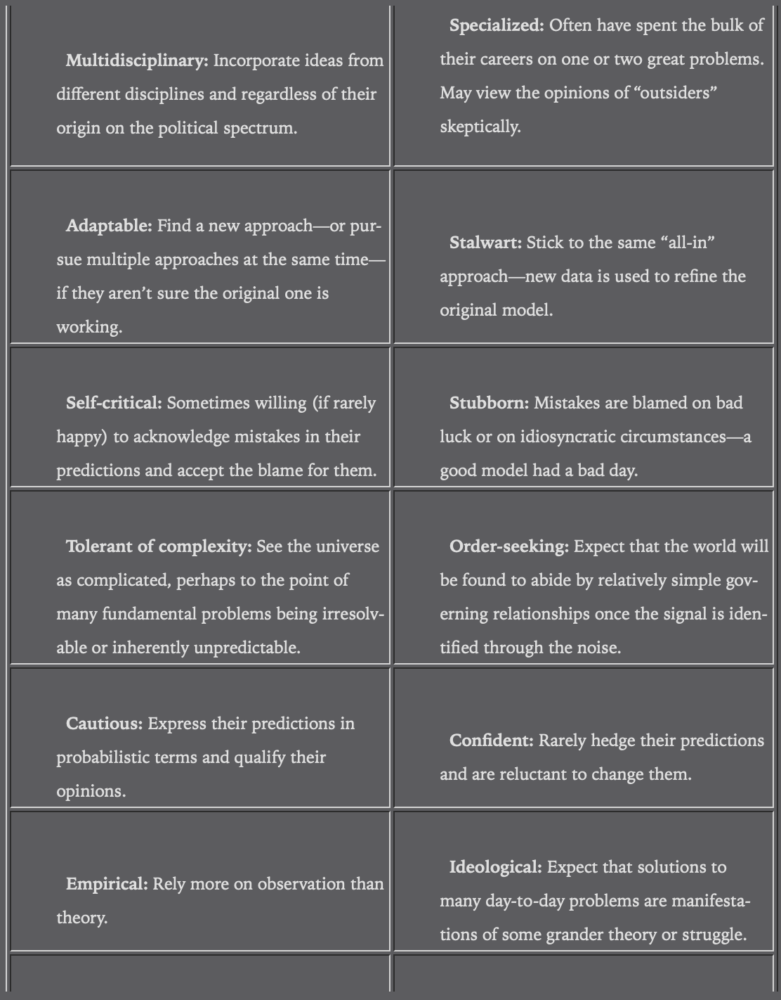
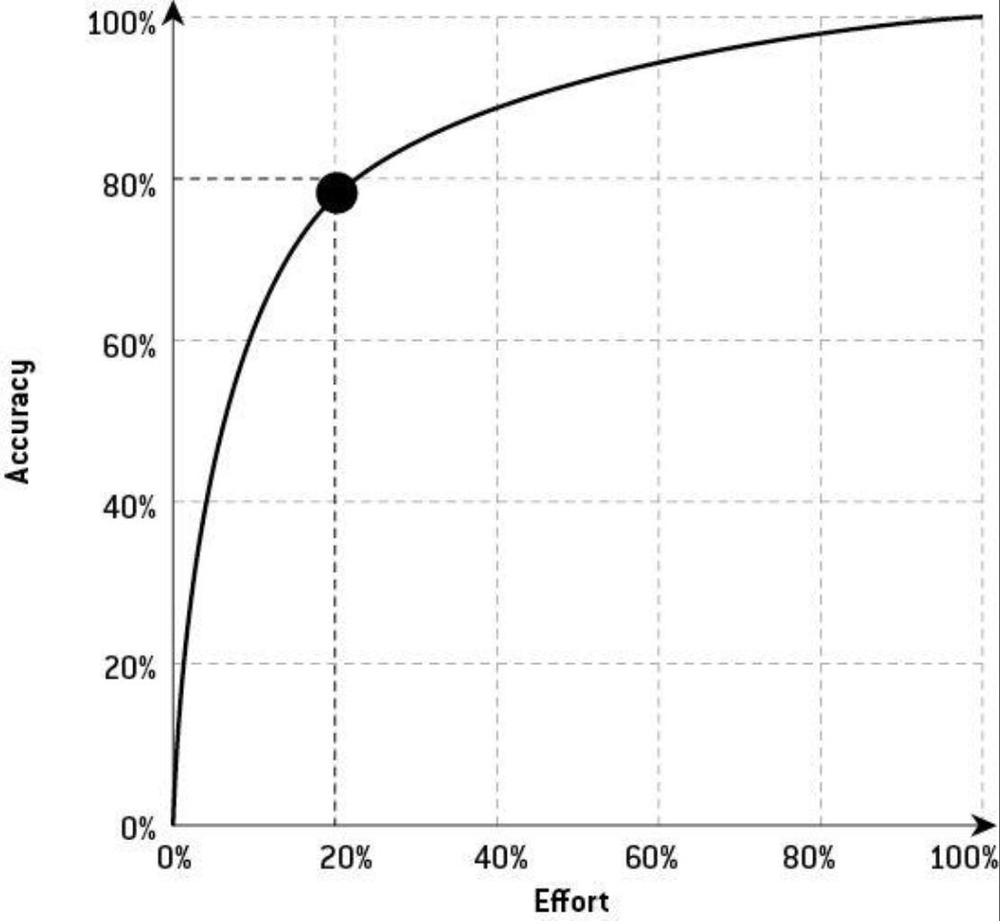
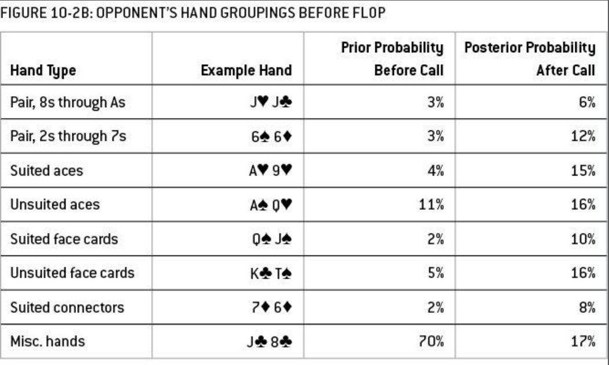

# The Signal And The Noise

## Info
- Type: book
- Author: TODO

## Category: practical

## Structure
### Outline
- Intro:
  - Problem with more data
  - Difficulty of prediction. Intro solution.
  - Outline structure
- Part 1: 7 chaps: prediction problem -> self-understanding of biases
  - Chap 1-3: fundamental questions regarding prediction problems:
    - Failure of prediction in financial crisis
    - Political prediction
    - Success of prediction in baseball
  - Chap 4-7: prediction of dynamic system:
    - Weather
    - Earthquake
    - Economy
    - Infectious disease
- Part 2: how to improve prediction: explore & apply Bayes solution:
  - Chap 8-10: prediction in sports & games:
    - Basketball
    - Chess
    - Poker
  - -> Understanding of randomness & uncertainty & how to use info
  - Chap 11-13: apply Bayes theorem to imp problems:
    - Bubbles in financial markets
    - Global warming
    - Terrorism

### Detailed structure
- Chap 1:
  - 2008 financial crisis as a failure of prediction at various stages
  - Out of sample problem in prediction
- Chap 2:
  - Political prediction
  - Dif between hedgehog & fox. Why fox make better prediction.
  - -> Imp of being objective
  - Author's political prediction principles
- Chap 3:
  - Baseball prediction
  - Scouting vs statistical approach
  - Imp of looking for new info
- Chap 4:
  - Philosophies regarding predictability
  - Chaos theory & difficulties in predicting dynamic system
  - Role of human in weather forecast
  - 3 definitions of forecast quality
  - Weather forecasting & imp of accuracy
- Chap 5:
  - Earthquake predictions
  - Overfitting problem
- Chap 6:
  - Predictions in economics
  - Complexity in economy
  - Problem of correlation without causation when there are lots of data
- Chap 7:
  - Problems of infectious disease prediction
  - Issue with extrapolation 
  - Self-fulfilling & self-cancelling prediction
  - Agent-based modeling
- Chap 8:
  - Sport betting
  - Bayesian inference: formular, implication
  - Fisherian statistics: way of thinking & problems
- Chap 9:
  - History of human vs computer in chess
  - Strength & weakness of computer in prediction
  - -> How to harness its power
- Chap 10:
  - Probability assessment & decision making process in poker
  - Mistake of judging a decision based on result. How to avoid.
  - Accuracy & effort
  - -> Imp of choosing fields with low competitiveness
  - Difficulty of getting proper feedback about skill when there is lots of luck involved
- Chap 11:
  - Efficient market hypothesis & difficulty of beating the market
  - Group forecast
  - Herding behavior
- Chap 12: climate prediction: criticism, how it had turned out
- Chap 13:
  - Analysis of threat of terrorist attack
  - Imp of imagination & consideration of the unknown unknown

## Author's problems & solutions
- Provide insight to: predict better, avoid repeating mistake: OK
- Investigate data-driven prediction in many fields: OK at surface level

## Presentation & style
- Author's claim:
  - Detailed -> immerse in the topic -> insight
  - Choose topics with public info -> verifiable
- Narrative style: stories of predictions in dif fields
- Basically an easy read: the book is long but messages are not condense: can read fast most of the time

## Terms
- Risk vs uncertainty:
  - Risk: quantifiable
  - Uncertainty: hard to measure
- Precise vs accurate:
  - Precise: exact number, result
  - Accurate: close to actual outcome
- Partisan: one-sided
- Calibration: of all predictions of x %, how often did it actually occur?
- -> Require lots of data to evaluate
- Overfitting
- Extrapolate: assume current trend will continue indefinitely into the future
- Self-fulfilling vs self-cancelling prediction
- Simulation vs statistical prediction:
  - Statistical: using past data, long-term average
  - Simulation: simulate the process (eg weather)
- Agent-based vs statistical model
- Frequentism vs Bayesian statistics
- Consensus (vs unanimity): broad agreement after a process of deliberation, when most members of a group coalesce around a particular idea or alternative
- -> Science resembles consensus process
- Unknown unknown: thing that we don't know we don't know, possibility that we haven't considered

## Arguments
### Introduction
- Problem with lots of info:
  - Instinctually cherry-pick the confirming info (confirmation bias) -> more one-sided
  - -> Need to be aware of the biases to get the benefits of additional info
  - More noise-to-signal ratio
- Still need theory to make sense of data, even in the age of big data
- Network effect -> wrong ideas & predictions can spread quickly
- -> Failing prediction can have great cost on society
- Predictions are needed in most situations:
  - Daily, simple planning
  - Big problem
- Possible solutions to prediction problems:
  - Regulation
  - Change of attitude (more imp):
    - Think differently about our ideas & how to test them
    - Become more comfortable with probability & uncertainty
    - Think carefully about our assumptions & beliefs that we bring to a problem
- To make better predictions:
  - Commit to pursue objective truth
  - Accept that objective truth will always be affected by subjective point of view
- Prediction connects subjective & objective reality: test theory by making falsifiable prediction in the real world

### 1. A catastrophic failure of prediction
- Common mistakes in making prediction:
  - Cherry picking, confirmation bias
  - Ignore hard to measure risks
  - Make incorrect, simplistic approximation & assumptions
  - Ignore uncertainty
- Out of sample problem:
  - Def: the event being predicted has never appeared before (there is some dif with past events)
  - -> Historical data can't be used to make prediction
  - Possible solution: expand the sample
  - -> Issue: more uncertainty, less clear relationship, less confident, less persuasive
- Precise problem: mistaking risk for uncertainty, making precise prediction when there is lots of uncertainty
- -> Failed sense of confidence
#### Additional info
- Dif assumptions about level of dependence in a system can provide very dif answers
- Common ways to explain away bad prediction:
  - Blame bad luck: less credible when:
    - Forecaster doesn't have history of successful prediction
    - Magnitude of error is large
  - -> Problems in the model, not the world itself
  - Plead ignorance: nobody saws it coming

### 2. Are you smarter than a television pundit?
- Confirmation bias:
  - More info -> worse prediction
  - Solution: recognize influence of our assumptions & biases in the forecast & question ourselves about them
- Principles of author's political forecasting model:
  - Think probabilistically: use a range of possible outcomes, assign probability to each outcome
  - -> Good forecast: each probability turns out to be right over the long run
  - Update forecast in light of new information. But be aware of over-weighting the imp of new info.
  - -> Keep record of all forecasts to evaluate forecasting performance over the whole course of predicting an event
  - Look from dif viewpoints, consider predictions from other forecasters
  - Aggregate dif types of info from dif fields into models. Qualitative factors can be considered (eg transformed using numerical scale).
#### Additional info
- Hedgehog vs fox writers/thinkers:
  - Hedgehog: believe in big ideas, principles that governing every interaction in society
  - -> Sound confident, more likely to appear in the press/TV
  - Fox:
    - Believe in many little ideas, take a many approaches toward a problem
    - More tolerant of nuance, uncertainty, complexity & dissenting opinion
  - -> Might be mistaken for lack of confidence & conviction
  - 

### 3. All I care about is W's and L's
- Scout (qualitative) vs statistical approach:
  - Scout bias:
    - Affected by irrelevant/not critical info
    - Group info into small numbers of categories -> less effective than statistical model which can have more data points & categories
  - Statistical bias: assume that if sth can't be easily quantified, it doesn't matter
- -> Collect as much info as possible, but be rigorous and disciplined when analyzing it
- -> Competent forecaster makes better prediction when more info is available
#### Additional info
- New ideas that provide competitive advantage are rarely found in normal thinking process
- -> Need to either:
  - Dig into the details
  - Think at the most abstract level to find alternative paradigm
- -> Require tools & habits

### 4. For years you've been telling us that rain is green
- Forecast is useful when:
  - We can do sth about it
  - There are people believing it
- Chaos theory: apply to systems which are:
  - Dynamic: past behaviors influence future behavior
  - Nonlinear: abide by exponential relationship
- -> A small change in initial conditions can produce large & unexpected divergence in outcomes
- -> Difficult to predict
- Weather forecast: introduce small changes intentionally to represent inherent uncertainty in observational data
- -> Turn deterministic into probabilistic forecast with a range of outcomes
- Role of human:
  - Know the flaws of the computer models
  - Inspect graph of 2 variable visually
  - -> Quick way to detect pattern & outliers
- 3 defs of forecast quality:
  - Accuracy: whether the reality match the forecast
  - Honesty: whether the forecast is the best one the forecaster is capable of
  - Economic value: whether the forecast help the public and policy-makers make better decision
- -> Accuracy is the best policy

### 5. Desperately seeking signal
- When disaster occurs, there is a tendency to look for a signal in the noise, anything that might explain the chaos
- Overfitting:
  - Mistake noise for a signal
  - Find an overly specific solution to a general problem
  - Usually happen when:
    - Data is limited & noisy
    - Poor understanding of the fundamental relationships
- -> Models score better on paper but worse in the real world

### 6. How to drown in three feet of water
- Problems of economic forecasts:
  - Only a single number is presented, not handle uncertainty
  - Difficulties:
    - Hard to determine cause and effect from economic stats: millions of statistical indicators
    - -> A few will correlate well with the event being predicted, without having any actual relationship
    - -> Shouldn't rely only on data without theory, esp in the age of Big Data and in fields where data is noisy
    - The economy is always changing
    - -> Explanation of past behavior may not apply to new business cycle
    - Data is noisy, subjected to revision
- Shouldn't ignore data, except when there is a fundamental shift in the problem
- -> Hard to know when the paradigm shift occurs
- How to improve forecasts' quality:
  - Supply-side approach: prediction market
  - Demand-side approach: reduce demand for inaccurate & overconfident forecasts
#### Additional info
- Rational bias: less reputation -> less to lose -> make more extreme forecast

### 7. Role models
- Problems in infectious disease prediction:
  - Extrapolation from small amount of unreliable data
  - Prediction change the way people behave -> self-cancelling & self-fulfilling predictions:
    - Increased attention & num publicly reported case: self-fulfilling
    - Increased public awareness & behavior: self-cancelling
  - Assumptions too basic
- What to do when prediction is hard:
  - Plan for dif scenarios
  - When the prediction is wrong:
    - Try to understand why
    - Plan for it
    - Minimize its cost
#### Additional info
- Should not extrapolate when predicting on exponential scale: range of possible outcomes too big
- Agent-based modeling:
  - Similar to simulation
  - Requires:
    - Lots of data
    - Lots of computational power
    - Different types of variables
    - Multi-disciplines: psychology, economics, local customs & surroundings...
  - Hard to test because major diseases are rare
  - Only help to perform experiments, not predicting outbreaks for now

### 8. Less and less and less wrong
- Don't think of the future in terms of no-lose bets, impeachable theories, infinitely precise measurements
- -> Think of it as probability
- -> Bet when our estimation of probabilities diverge by a sufficient margin from the odds on offer
- Bayes's theorem: conditional probability: probability that a theory/hypothesis is true if some event has happened:
  - 3 quantities needed to be known/estimated:
    - P(event) conditional on the hypothesis being true: P(E|H)
    - P(event) conditional on the hypothesis being false: P(E|!H)
    - Prior: P(hypothesis) before the event
  - -> Posterior probability: P(H|E) = P(H).P(E|H) / ( P(E|H).P(H) + P(E|!H).(1-P(H)) ) 
  - = P(H^E) / ( P(E^H) + P(E^!H) ) = P(H^E) / P(E)
  - Need to continuously update probability as new evidence comes
  - -> Converge toward truth
  - Provide a good description of how we react to events in the world by explicitly ack-ing prior beliefs
  - -> No evidence can change a person's belief if it is assigned a 100% probability
- Counter-intuitive case: false positive: if P(H) is low, P(H|E) can be low
- -> Prior is resilient despite new evidence
- -> Bigger picture get lost when focusing too much on new information
- Fisherian statistics:
  - Uncertainty in a statistical problem results from collecting data among a sample of the population rather than the whole population
  - -> Sampling error
  - Implication:
    - Focus on experiment error, not human error
    - Error can be reduced by collecting more data
  - Problem:
    - Sampling error is only one type of error
    - Need to define a good sample population
    - Discourage researcher from considering the underlying context/plausibility of the hypothesis
    - -> Can't distinguish correlation from causation
- Scientific method: getting closer to truth by:
  - Observe a phenomenon
  - Develop a hypothesis to explain the phenomenon
  - Formulate a prediction from the hypothesis
  - Test the prediction
#### Additional info
- The past and the future both can be expressed in terms of long-run probabilities
- -> Dif from the present: only 1 thing can happen

### 9. Rage against the machine
- Heuristic approach to problem-solving: apply rules of thumb when a deterministic solution is beyond practical capacity
- -> Biases and blind spots will exist
- Human strengths:
  - Handle abstract, open-ended problems
  - Creativity & imagination (eg devise strats, develop theories)
- Computer strengths: fast, reliable computation
- -> Need good data & instruction
- 3 types of fields:
  - Have simple, well-understood laws but requires lots of calculation (eg weather forecast, chess)
  - -> Computer is useful
  - No good understanding of root causes & noisy data (eg economic, earthquake forecast)
  - -> Computer is not useful
  - Decent data, imperfect understanding of cause
  - -> Need trial and error approach: human produces lots of ideas, then test them with data & prediction
#### Additional info:
- When there is not enough time to process information: might need to trade off between breath and depth
- When the model produces unexpected/hard-to-explain result: should lean toward "bug" interpretation
- Biases & blind spots of the forecaster will be replicated in his computer program

### 10. The poker bubble
- Avoid result-oriented bias: blaming luck for failure & taking account for success
  - When there is short feedback loop: apply more rigor in evaluating predictions
  - When the data is noisy: focus more on decision making process, not result:
  whether the right attitudes & skills are applied
- Prediction learning curve: getting the basic right improves accuracy a lots:
  - 
  - Enough, high-quality data
  - New, usable technology
  - Focus on accuracy, not comfort or fame
  - Develop heuristics grounded in experience & common sense
  - Develop systematic process to make a forecast
- Sometimes how good the prediction is in an absolute sense is less imp than how good it is relative to the competition
- -> Need lots of effort to beat the competition, diminishing return will set in
- -> Should consider strength of the competition & focus on uncompetitive areas
- In fields that involve lots of luck, dif in skills might take a long time to be visible
- -> Need to be honest with yourself, adjust belief of whether you are good based on results & prior expectation
- -> Need to ack which is under control and which is out of control
#### Additional info
- Poker is good for practicing probabilistic judgement under uncertainty

### 11. If you can't beat 'em...
- Betting market: create incentive by putting money on opinion
- Group forecast:
  - Usually beat typical individual one, but not necessarily a good forecast or the best forecast
  - Only holds when individual forecasts are made independently
- -> Still need to improve individual forecasts to improve group performance
- Should have a strong supporting evidence if your forecast is against the consensus view
- -> Can occasionally beat the market, but not all the time
#### Additional info
- Traders judged on short-term performance will follow the herd
- -> Bubbles might be inevitable
- Opportunities to short a bubbles or long a panic will come every 15-20 years, but not enough to make a steady career

### 12. A climate of healthy skepticism
- Noisy data can obscure the signal, even in cases where there is no doubt that the signal exists
- Always make a backup plan (reasonable baseline case) in case the model fails
#### Additional info
- Conclusions regarding global warming:
  - Greenhouse effect almost certainly exists & will be exacerbated by manmade of CO2 emissions
  - -> Likely to make the planet warmer
  - Impacts of warming effect are uncertain, but likely not good

### 13. What you don't know can hurt you
- There are cases where there are lots of signal
- -> Need signal analysis capabilities to sort out the relevant signals
- Tendency to mistake the unfamiliar for the impossible
- -> Need to admit what we don't know

### Conclusion
- Strategy to close the gap between what we know and what we think we know: Bayesian thinking:
  - Hold different hypotheses at once
  - Set prior based on past/collective exp or common sense, update based on new evidence
  - Don't mistake approximation for the real world
  - Make lots of forecasts & test them
#### Additional info
- Nature might become more predictable
- Human affair will become harder to predict because of new technologies

## Criticism
- Chap 8 discuss disadvs of Fisher approach but doesn't describe it first
- Chap 10 when considering between call and fold decisions, should take stake into account (win/loss amount, not probabilities)
- Chap 11 analysis of economics & financial market is quite shallow
- The topics in many chapters are big (eg economics, finance)
- -> Some high level overview of the issues and lessons are presented, but clearly not detailed enough

## Takeaways
- Basic poker skill
- Fuller understanding of scientific method & role of prediction in science
- Problems of prediction, esp in the age of big data
- The need of having a theory before making prediction
- Differences between simulation and statistical model
- Better understanding of Bayesian theorem & imp of thinking probabilistically

## Additional info: Poker
- Less of a psychological game than a mathematical game:
depends on making probabilistic judgements under uncertainty
- Skills:
  - Basic skill:
    - Odd calculation
    - Decision-making:
      - Fold worst hands
      - Bet best hands
      - Make some effort to consider what the opponent holds
  - Analytic skill: hand reading: figure out:
    - Which cards your opponent might hold
    - How they might affect her decisions throughout the rest of the hand, her Bayesian model
  - -> Think about many hypotheses, weight & balance against the opponent's actions
  - Make your play unpredictable:
    - Aggressive play with hands like 7-6, same suit:
      - If big cards come onboard, opponent might give credit & fold
      - If small cards: might be able to make a pair
      - Sometimes can make straight/flush which can tilt opponent
    - -> When opponent catches on the style, they will call down when we have a better hands (eg pair of king)
    - Slow play with really good hand
- Poker forecast: probabilistic:
  - Will become more precise as the hand is played out
  - But usually not possible to predict exactly which of the 1326 possible hands the opponent holds
- -> Shouldn't try to put opponent into an exact hand, but make a fuller assessment of probabilities
- Thinking process:
  - First: others can't hold our cards
  - Break opponent's range into groups of hands functioning in the same ways
  - Hand groups & probabilities, call before flop:
  - 
- Common behavior:
  - Most players fold against a raise before the flop unless they have a decent hand
  - When a player call (not raise) before the flop:
    - Usually he has a decent hand
    - Unlikely that he has a strong hand (unless he tries to bait by slow playing)
  - When a player call after the flop:
    - His hand connected strongly with the flop
    - Higher hand before the flop
    - Worse hand than ours, but expecting a straight/flush
    - Worse hand, only try to bluff
  - When a player call after the turn: likely a pair of high cards (eg K)
  - When a player all-in after the river while we have a good hand:
    - Suited connector -> call with it before the flop & after when expecting straight/flush
    - -> Unlikely since it has low prior probability
    - Set of low cards
    - 2 pairs
    - Slow play set of high cards
    - Complete bluff -> counter-balance slow play possibility
  - -> All possibilities are low, should still call
- Should only play when there are 1-2 bad players in the game
- Luck component is strong, will take a long time to figure out how good you are
- -> Avoid tilting