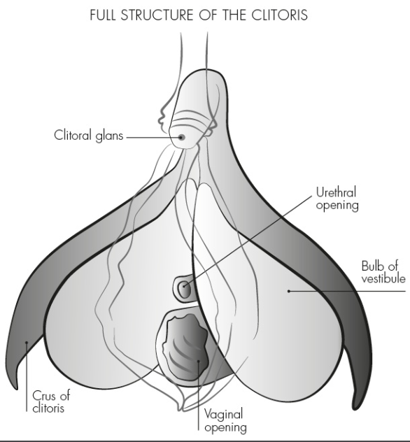
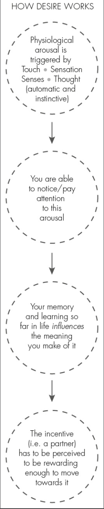
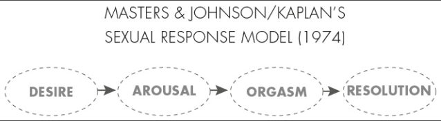
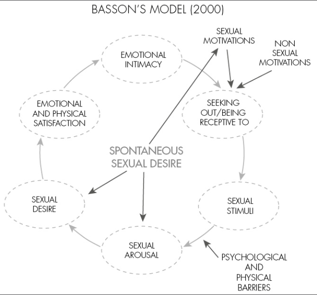

# Mind The Gap

## Info
- Type: book
- Author: Karen Gurney

## Category
- Psychology
- Biology
- Self-help

## Structure
- Part 1:
  - Wrong beliefs & cultural origin
  - Facts about sex: across the population & about the individual
- Part 2: key aspects of how sex & desire work:
  - Impact of society
  - Context of relationship
  - Psychological process
- Part 3: from theory to practice: improve sex life & rela

## Problems
- Sex: wrong beliefs (eg monogamy works), unrealistic standards
- New scientific facts about sex is not popularized yet: hindered by moral, social & cultural opinion

## Goals
- Fill the gaps in:
  - Sexual expectation & reality
  - -> New sense of what is normal
  - Knowledge about sex & desire
  - -> Control & cultivate them
  - Others: gender equality, orgasm
- -> More satisfying sex life & relationship
- Non-goal: address differences in experience of sex for trans/non-binary people

## Terms
- Spontaneous desire (without triggers & context) vs responsive desire
- Genitals: cơ quan sinh dục
- Clitoris: âm vật, hột le
- Uterus: tử cung
- Ovary: buồng trứng
- Vulva: âm hộ: outer part
- Vagina: âm đạo: inner part
- Sex:
  - Broad, flexible term, not limited to penetrative vaginal sex
  - Def: biopsychosocial phenomenon: not only physical,
  but also psychological & relational (eg connecting with another) & social/cultural
- Good sex:
  - More than just the absence of a sexual problem
  - More than a technique/physical act
- Sexology: scientific study of human sexuality
- Consensual non-monogamy
- Passionate love phase vs companionate love phase
- Sexual script: preconceived, societally dictated norms about how we should behave during sex
- Casual sex (with new partner) vs partner sex
- Motivations for sex:
  - Approach motivations: have sex for positive outcomes, eg receiving pleasure or experience intimacy
  - Avoidance motivations: have sex to avoid negative outcomes, eg prevent a partner leaving, resolve a conflict
- Intimacy: emotional closeness or connection, trust, security or familiarity
- Sexual currency: amount of sexual charge or interaction with a sexual partner outside of actual sexual experiences
- Sexual stimulation: things which our brains code as sexual
- Concordance: to what degree brain and genitals are in sync when it comes to arousal

## Style
- Author's claim:
  - Focus on influence of gender on sexuality -> content focus more on women
  - Focus less on role of biology, more on role of society, gender politics, psychology & relationship dynamics on sex
  - Good sex: no how-to guide -> focus on changing how people relate to their body, gender, relationship & themselves
- Ref: mainly paper & some books
- Not a good command of English: lots of complicated, incomprehensible sentences
- -> Obfuscation?
- Summary & exercise after most chapters
- Lots of real-life examples/scenarios (many are repeated)
- Too much repetition, content is not condensed enough
- Overall structure is ok, but content of each chapter is not well organized

## Content

### Introduction
- Problems
- Goals
- Style
- Structure

### I - Common misconceptions and how they are holding us back

#### 1. A brief history of sex, science & gender politics
- Key influences to view about sex: religion, psychiatry, science & gender politics
- Some highlights:
  - Women's right movement
  - Increasing role of science
  - Feminist moment & impact on sex science

#### 2. Mind the gap - statistics around sex and desire
- Stats about frequency, satisfaction & sexual problems:
  - Only a small part feels distressed by the problem
- Positive impact of sex on relationship & exceptions
- Causes of sexual distress:
  - Negative impact on partner
  - How we are sexually, esp regarding desire, is lower than expectation, 
- Desire stats:
  - Difference in sexual desire between partners is common
  - -> Negotiating the difference is imp to have good sex
  - Factors affecting desire:
    - Less biology, more psychology
    - -> Not much difference between men & women
    - Typical drop in desire after entering companionate love phase (1-2 years):
      - Time is not the key factor -> can work on other factors
      - Drop in desire doesn't always lead to sexual/relationship dissatisfaction
    - Difference between genders:
      - Belief that men have higher desire is not supported by research
      - -> Such expectation has negative impact on men
      - Long-term monogamy & gender inequality reduce women's desire
- Difficulty in measuring & deciding what is the right amount of desire:
  - Desire is not static -> can only measure in one moment
  - Desire depends on context
  - Women's desire is more responsive

#### 3. Gaps in our foundations
- Sex edu:
  - Problems:
    - Very little positive sex talk
    - Absence of talk about sex at home
  - -> Focus on what could go wrong, not how to do it right
  - -> Should avoid that thought tendency
  - Sex neutral education def:
    - No negative reactions when a young person telling that he is sexually active
    - Help them think through their options with regards to their sexual health
  - Sex positive education
    - Def: have frank & open conversations about celebrating pleasure, sex,
    & how we can work with our bodies & relationships to get the best out of them
    - Suggestions & resources
- Clitoris:
  - Structure: ~penis:
    - 
  - Function: key source of pleasure for women
  - How women can have pleasure: by stimulating glans & bulbs & legs of clitoris, not by penetration only
- Orgasm gap:
  - Stats:
    - Women can come as easily as men from masturbation
    - Women have lower rate of orgasm than men when having sex together
  - Non-cause: women's sexuality, capacity for pleasure or anatomy
  - Cause: the type of sex people usually having (penetrative vaginal sex) is not good for women pleasure (or orgasm?)
  - -> Lack of knowledge is only a partial cause
  - Perceived cause: women themselves
  - Sexual activities & related rate of orgasm (from higher to lower):
    - For women:
      - Masturbation
      - Clitoris stimulation by hand by partner
      - Oral sex
      - Penetrative vaginal sex
    - For men:
      - Penetrative vaginal sex & masturbation
      - Oral sex & penis stimulation by hand
  - Orgasm is a part but not all of good sex
- Sexual scripts:
  - Def
  - Common scripts:
    - Women's orgasms are elusive and should not be expected
    - Men's sexual pleasure is more important
    - Real sex = penetrative vaginal sex
- Language gap in describing women's genitals:
  - Mistaking vulva & vagina
  - Don't know about structure of women's genitals
- 3 primary conditions for good sex:
  - Psychological arousal (eg how close to our sexual fantasy):
    - How much of what is happening involves experiences or contexts that you find erotic
    - How much the connection you have with that person meets these needs also
  - Physical touch: how close the physical stimulation is to the type of physical stimulation
  that makes your body feels good (eg type of kiss, penetration, touch)
  - How present you are (eg mindfulness & autonomy, lack of distraction or worries)
- Good at sex: good at talking about sex or responding to feedback, not there is a right way that usually works
- Sexual preferences:
  - Are individual
  - -> Need to understand what types of sex are good for you and in what contexts before negotiating with partner
  - It is also imp to explore & challenge your own pleasure, not only following it
  - Should acknowledge that preferences are changing
  - -> Need to map out conditions for good sex periodically
- Practice: understanding conditions for good sex:
  - Draw a triangle on a large piece of paper & write the 3 headers:
  psychological arousal, physical touch, being present on each point
  - -> Think back to the 3 best & 3 worst sexual experiences with another person
  - -> Recall everything about these experiences that make them great or not to fill in each section
  - Add to the triangle anything you have not experienced in real life but feel you would like,
  and anything that works during masturbation but less so with a partner
  - -> Suggested points: see book
  - Get partner to read & complete their own conditions for good sex, then share with each other
  - Find solution:
    - Try out/build on what you don't know
    - Work on what you know but doesn't happen frequently
    - Negotiate/reconcile conflicting preferences

### II - The truth about sex and desire

#### 4. Sex in our society
- Human tendency to identify within a certain group & adhere to social norms
- -> Family, culture, society & language has large but unrecognized impact on people's sex lives 
- Negative social scripts/norms:
  - Impact is affected by gender equality
  - Hetero-normative world
  - -> Negative impact on non-hetero people
  - Negative influence of media, mainly how TV present sex as easy, spontaneous & penetrative
  - Mainstream free porn:
    - One of the main way to learn about sex
    - Bias:
      - Lack of attentiveness to female sexual pleasure
      - Focus more on man's orgasm
  - Causes & negative impact of faking orgasm
  - Gender gap in giving oral sex
  - Body image:
    - Def: how we feel about our bodies
    - Women's concern about body image
    - -> Distraction -> affect enjoyment & desire
  - Easy of spontaneous sex
  - 3 times a week myth
  - Expectation of inevitable decline in sexual satisfaction or passion
  - -> Self-fulfilling hypothesis: not trying to improve
  - Seeing human as essentially monogamous
  - -> Expectation that fidelity and satisfaction should come easily, without effort
- Negative implication of popular vocabulary:
  - Virginity: indicate sex as giving away instead of gaining
  - Blue balls: men must come
  - Foreplay: there is only 1 way of having sex
- Importance of time/variety in sex to avoid habituation
- -> Advice: try out different things, be direct in communication
- Planning for sex is helpful as long as the plan is not too detailed and expectation is not too high
- -> Use conditions for good sex as a guide to setup the right environment

#### 5. Sex in our relationship
- How desire & feeling change over the course of a relationship:
  - Early stage: wanting, lust & obsessive thoughts
  - Later stage: opportunity for knowing another person intimately (physically, sexually & emotionally)
  & foundations that can lead to personal, sexual & emotional growth
- Relationship dynamics -> showing only 1 part of sexual self
- -> Reluctant to act in a dif way in long-term relationship
- -> Negative impact on sex & rela
- Dif ways of interpreting sex & dif types/expressions of sex
- -> Influenced by popular interpretations in culture
- Communication:
  - Includes both verbal & non-verbal communication
  - Difficulties: cultural
  - Advantages:
    - Partner can adapt to changing preferences
    - Can negotiate about when/what to do
- Initiation:
  - Def: a communication that says "shall we?"
  - Challenges:
    - Too indirect: being misunderstood/not noticeable
    - Too blunt -> pressure
- Motivations for sex:
  - Many things, not only desire
  - Need to understand what partner's needs are to meet it, either by sex or other ways
- Desire discrepancy between people in a rela: normal pattern
- Having children: reduced desire due to:
  - Biological causes: mainly tiredness, sleep deprivation
  - Other causes: eg too busy
- -> Only temporary
- Advices:
  - Need to work on communication outside of sex life
  - Avoid having sex for avoidance reasons
  - Need to negotiate desire discrepancy
  - Intimacy: too close, lack of personal space can reduce desire
  - -> Try to experiment to find the right level of intimacy
  - Rela security: should not be taken for granted
  - -> Need to nurture the rela
  - Imp of novelty & self-development
  - Should prioritize time together & time for sex
  - Equality is imp to good sex & rela
  - Should make conscious effort to increase sexual currency
  - -> Advantages:
    - Good for desire
    - Acting less awkwardly
    - Relate to each other more as sexual partner

#### 6. Sex in our brains
- Sexual desire: dif vs other biological derives:
no physical deprivation: the longer people go without sex, the less desire they have
- Mental process: from desire to behavior
  - 
  - Attention:
    - Source of distraction: thoughts about your own life or sexual response
    - Some distraction/self consciousness/thoughts are normal
    - -> Too much is problematic
  - Thoughts:
    - Positive thoughts during sex turn up sexual response
    - Most of the thoughts are negative, originated from sexual scripts
    - -> Need to find the root to change
  - Types of rewards from sex:
    - Meet motivations to be sexual
    - Improve mood
- Mindfulness as a technique to improve attention & sex quality

#### 7. Gaps in our understanding of desire
- Sexual response models:
  - Outdated, popular model:
    - 
    - Problems:
      - Desire comes first
      - -> Sex as a purely biological derive -> not correspond to reality
      - Linear model: based on male physiology
      - -> Not correspond to reality, esp for women
  - New model:
    - 
    - Barriers:
      - Psychological: eg attention, thoughts, learning & association, expectation & pressure
      - Circumstantial: ie too busy to have time for sex
      - Physical: eg medication used, tiredness, hormonal changes, pain during sex
    - Sources of desire:
      - Spontaneous
      - Responsive:
        - Stimuli from partner
        - Stimuli from sources other than the partner (eg watching porn, reading about sex)
        - -> Should experiment with it
    - Emotional & physical satisfaction: ie orgasm & other rewards from non sexual motivations
- Spontaneous desire is usually higher:
  - With new partner
  - After some time apart
- It is likely that all desire is technically responsive
but that we may not always be consciously aware of the triggers for our spontaneous desire
- -> Both experiences of spontaneous & responsive desires are valid & normal,
affected by factors in life/rela/context/circumstance & psychology
- Common scenario: desire discrepancy
- -> One partner hyper-vigilant to being disappointed and the other hyper-vigilant to disappointing
- -> Need to build a culture of high receptivity & low pressure
- Additional info: where to touch (depends on individuals): avoid sensitive areas (eg breast), start with shoulders/neck

### III - How to futureproof your sex life, for life

#### 8. What next?
- How changes happen:
  - Small change from gaining new understanding
  - Big changes involving planning/forming new habits
  - -> Need to involve partner
- Improve your own sexuality:
  - Masturbate to explore preferences, increase concordance
  - Increase sexual confidence & overall self-confidence
- Communicating & collaborating with partner:
  - Get partner to read the book
  - Anticipate difficulties for men to accept ideas in the book & approach the subject subtly
  - Talk about the goal & plan steps toward it
  - -> Focus on the goal, not the problem, encourage action & collaboration
  - The conversation:
    - When: good time
    - Content: needs, goal, impact on rela
    - Listen to & respond to partner's perspective

#### 9. Futureproof your sex life, for life
- Good sex life: depends on individuals. Suggestions:
  - Meet conditions for good sex
  - Meet motivations for sex
  - More novelty, variety & pleasure in sex
  - Increased sexual currency
- Deal with life challenges:
  - Accept that sex/desire sometimes might be less good or is de-prioritized
  - -> More positive view, not blame partner/rela, more likely to take action
  - Increase sexual currency
  - -> Advantages:
    - Can recover sex life to previous level more easily
    - Meet sexual needs without having sex
- Deal with changing needs/preferences:
  - Accept that sexuality (eg preference, physical condition) is not static
  - Regular review & conversation
  - -> Proactive approach, anticipate & prevent problems
  - Embrace changes as opportunities to experiment sth new

## Criticism
- Author had some trouble controlling her annoying, hateful, spicy tone in many parts,
especially when talking about gender inequality
- Chap 3:
  - Mistaking orgasm = pleasure. Women have different sources of pleasure: penetration & clitoris stimulation.
  - Distorting the truth of how sex usually happens: men not trying to come to increase women pleasure
- Chap 4: very late acknowledgement of research limitation: focused on white women
- -> Writing the whole chapter matter-of-factly, trying to mislead readers

## Takeaway
- Sexual scripts
- Structure of female's genitals
- Biological/psychological mechanism of sex & desire, esp of women: pleasure, orgasm, spontaneous vs responsive desire
- -> How to cultivate good sex & relationship
- Opportunity for reflections on past experience
