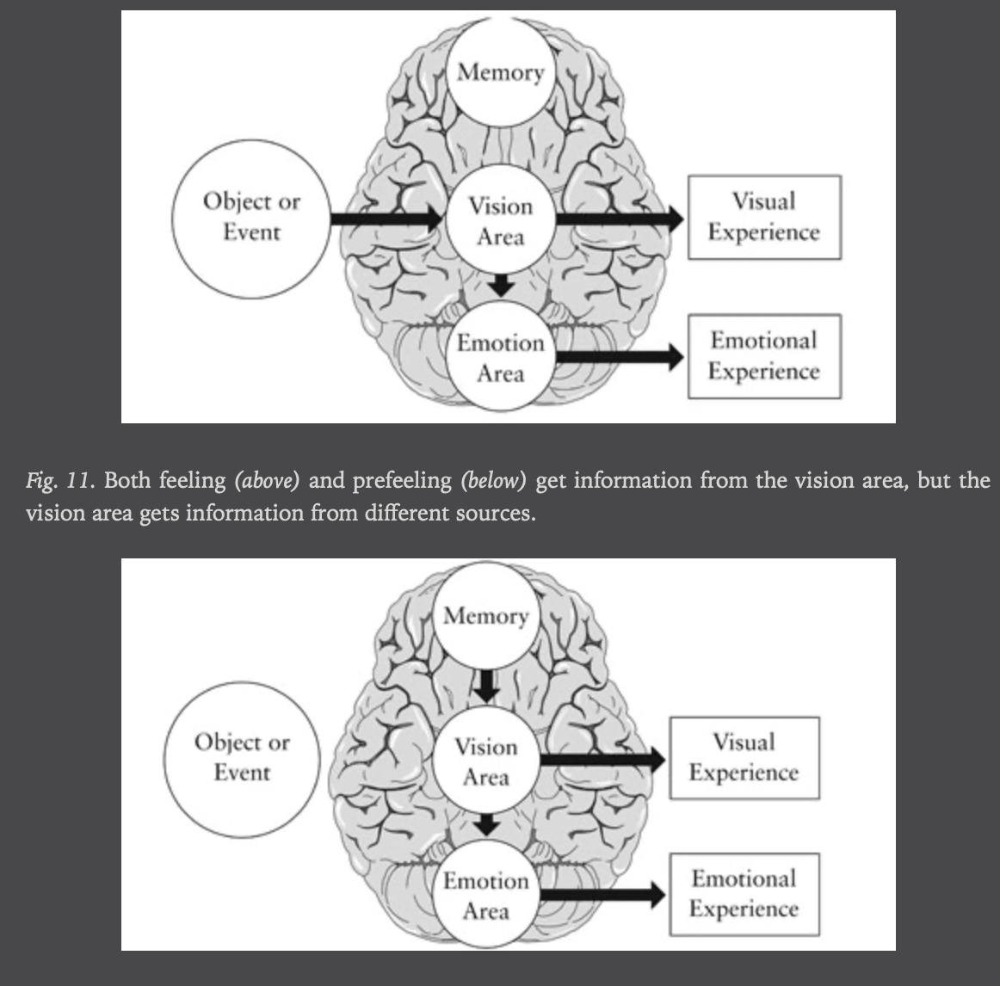

# Category
- Psychology
- Neurology

# Outline
- Foreword: problem & goal
- Part 1: prospection:
  - Human's unique ability to predict: nexting vs predicting, why
  - Book's structure
- Part 2: subjectivity: science of happiness
- 3 short-comings of foresight:
  - Part 3: realism
  - Part 4: presentism
  - Part 5: rationalization
  - Part 6: corrigibility:
    - Difficulty of overcoming the shortcomings of imagination by learning from personal experience/collective wisdom
    - Remedy
- Afterward: book's summary

# Goal
- Describe scientific facts about imagination: mechanism & limitations
- Explain the systematic failure to imagine personal future & predict future emotional response
- Non-goal: guidance on how to be happy

# Terms
- Corrigibility: ~improvement

# Style
- Claimed by authors: multi-discipline account -> readers need to judge for themselves
- Funny, accessible
- Contain brief descriptions of studies as illustrations
- Lots of reference to academic text in Notes

# Criticism
- Some descriptions of experiments are difficult to understand
- Failure to ack the limitation of lab experiments
- Chap 3: tool of other sciences are also imperfect?
- -> The meaning of objectivity is that dif people can agree on the measurement
- -> Impossible when measuring subjective exp
- Chap 11: the lab experiments used to illustrate the effectiveness of surrogation only deal with simple prediction

# Content
## Foreword
- People are future-focused, trying to make the future-self happy
- -> Foresight is limited, most of the time the plans don't work out
- The mistake of foresight is regular & systematic
## I - Prospection
### 1. Journey to elsewhen
- Human's unique ability to predict:
  - Nexting vs predicting:
    - Nexting: predict about local, immediate, personal future
    - Predicting (frontal lobe): project ourselves into the future, make long term plan
  - Why making predictions:
    - Emotion:
      - Good event: pleasurable
      - Bad event:
        - Reduce/avoid unpleasant impact
        - Enforce prudent behavior via fear, anxiety, worry
    - Control:
      - Having control: fundamental need, positive emotional impact
    - Wrong reason: to control the future -> book's goal

## II - Subjectivity
### 2. The view from in here
- Different conceptions of happiness: emotional, moral & judgemental:
  - Emotional: subjective feeling of happiness
  - Moral: mistaking cause of happiness (virtues) vs happiness feeling
  - Judgemental: use "happy that" as an expression of approval
- -> Emotional happiness matters more to individual
- Difficulty in comparing subjective happiness:
  - Remembering: memory reduce exp for efficiency -> difficulty in comparing present & past exp
  - Perception: comparing moment to moment exp is more reliable, but requires attention
  - Communication:
    - Language reduces exp for communication
    - Language-squishing hypothesis & experience-stretching hypothesis:
    feeling more/less happy due to limited/extensive exp

### 3. Outside looking in
- Scientific study of happiness (psychology in general):
  - Difficulties:
    - Experience (participation) vs awareness (observation):
    - Physiological arousal arises automatically, people are not always aware of the causes
    - -> Incorrect interpretation of the cause
    - Scientific objectivity & the study of subjective exp: difficulty in measurement
  - Mitigations:
    - Use realtime report of attentive individuals
    - Measure often, with large samples -> law of large numbers correct for variations

## III - Realism
### 4. In the blind spot of the mind's eye
- Filling in mechanism: memory, perception (eg filling eye's blind spot) & imagination
- Autonomous tendency for realism: equate subjective sense of things with the objective properties of those things
- -> Consequence: treat details filled in as real when imagining & not recognizing it
### 5. The hound of silence
- General inability to think about absence
- -> Treated as not imp when imagining -> missing imp details
- Tendency of thinking about far vs near future/past:
  - Far: abstractly about why it happens
  - Near: concretely about how it happens, with more details
- -> Autonomous process -> fail to recognize the difference
- -> Make commitments to be regretted when the moment to fulfill them arrive

## IV - Presentism
### 6. The future is now
- Imagination mechanism: use the same sensory areas of perception
- -> No real sensory input -> use memory as input for imagination
- Same process for imagining future feeling (prefeel):
areas of the brain that response emotionally to real events also response emotionally to imaginary events
- -> Imagine the event -> response emotionally -> use the emotion as prediction
- First cause of presentism: same brain areas used for both perception & imagination
- -> People only recognize when the brain prioritizes sensory perception over imagination,
not when it prioritizes current emotion over emotional prediction
- -> Prefeeling is influenced by current emotion
- 
- Filling-in material: the present
- -> Affect memory, esp memory of past emotions
### 7. Time bombs
- Second cause: pitfalls when reasoning about time:
  - Time as space (eg arrow of time): tendency to think about similar concrete things when reasoning about abstract concepts:
    - Time or variety can deal with habituation from repetitions (declining marginal utility)
    - Think about dif occasions as adjacent in space -> underestimate role of time -> overvalue variety
  - Anchoring & insufficient adjustment:
  imagine the event happening now and adjust for the fact that it is going to happen later -> future is more like the present
  - Comparison:
    - Easier to remember & compare with the past (relative) than to generate and compare with new possibilities (absolute)
    - -> Make relative comparison instead of absolute comparison
    - -> Framing effect, loss vs cost
    - When comparing the possibles: influenced by extra options -> framing effect & comparing unimp attributes
  - -> Autonomous & smooth process -> Fail to account for possible dif way of comparing in the future

## V - Rationalization
### 8. Paradise glossed
- Observation: most people are resilient in the face of trauma:
  - Experience stress in a short period
  - Many people claim their lives are enhanced by the exp
- -> In contrast to how others imagine they would be in a similar situation
- Factors affecting the process of disambiguating & finding meaning: context, frequency, recency & personal preference
- Most experiences are ambiguous
- -> Personal preference as a source of positivity & resiliency: tendency to think positively about personal experience
- Psychological immune system (~confirmation bias): to make a positive view credible, not delusional:
  - Select/seek favourable facts
  - Avoid/ignore/forget/challenge unfavourable facts
### 9. Immune to reality
- Failure to be aware of & to predict the effect of psychological immune system -> mis-predict future emotional reaction
- Opportunities for rationalization:
  - Intensity of the negative exp: higher -> more likely to trigger -> very bad exp might be better than bad exp
  - Commitment = no choice -> less freedom might be better -> overestimate value of options
  - Regret: people regret inaction more than action:
    - Action provide oppo for rationalization (eg things learned form the exp)
    - Inaction: can only blame themselves, can't blame others
  - -> Contrast to popular theory when making decision -> wrong choice
#### Addi
- Explanation reduce impact of trauma but also of pleasant events

## VI - Corrigibility
### 10. Once bitten
- Difficulty in learning from practical exp: selective memory:
  - Availability heuristic from unusual exp (peak effect)
  - -> Think of the best/worst exp as more frequent than it is & use it to predict instead of using the normal/average one
  - End effect
  - -> Choose exp with better ending
  - Reliance on personal theory to construct memory of past emotion
  - -> Wrong theories create wrong memory -> Continue using those memory to make future prediction
- Some popular but not corroborated theories:
  - Women are more emotional than men
  - Men & women have different emotional reactions to similar events
  - Women are particularly prone to negative emotions at particular points in their menstrual cycles
### 11. Reporting live from tomorrow
- Difficulty in learning from others: false but propagating beliefs:
eg promoting social stability (eg joy of money, joy of children)
- Solution: surrogation: consult real people currently in such situation:
  - Effectiveness: consulting 1 randomly select reporter is more effective than imagining
  - Difficulty in application:
  tendency of seeing one self as unique & strong belief in individual difference, esp with regard to emotions:
    - Learned about oneself in a subjective way
    - Belief in self uniqueness provides enjoyment
    - Daily focus on individual difference: considering similarity has little social utility
#### Addi
- Facts about having children:
  - Couples generally start out quite happy in their marriages
  and then become progressively less satisfied over the course of their lives together,
  getting close to their original levels of satisfaction only when their children leave home (footnote 17)
  - The only known symptom of "empty nest syndrome" is increased smiling  (footnote 18)
  - This pattern of satisfaction over the life cycle describes women (usually the primary caretakers of children)
  better than men (footnote 19)
- Tendency to attribute choices of other people to attribute of the chooser, but our own choices to feature of the option
- -> Implication for thinking about freedom
