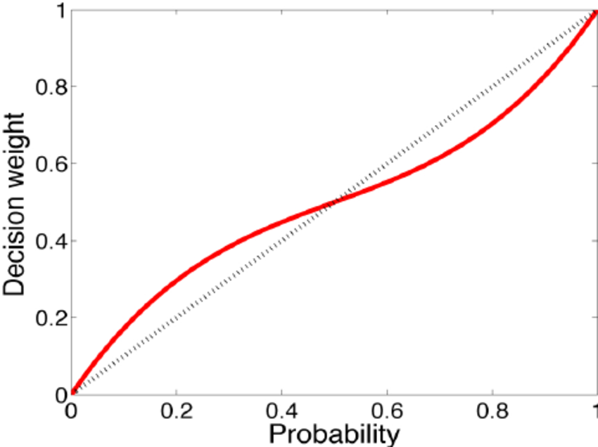

# I. Two Systems
## 1. System 1 (automatic) & system 2 (effortful)

## 2. Attention & effort
- Limited attention
- Law of least effort

## 3. The lazy controller
- System 2 control suggestion from system 1
- Cognitive busy
- Ego depletion

## 4. The associative machine
- Associate by: causal, properties, categories
- Priming effect

## 5. Cognitive ease – strain
- Familiarity (repetition) `<->` cognitive easy -> truth
- Persuasive message:
  - Memorable (verse)
  - Clear text (high contrast, bright color, bold text)
- Good mood:
  - Intuitive
  - Creative (associative memory, intuition of coherent)
  - Less vigilant
  - Prone to logical errors

## 6. Norms, surprises & causes
- A & B -> A cause B: more coherent

## 7. A machine for jumping to conclusions
- Risky when:
  - Situation is unfamiliar
  - Stakes are high
  - No time to collect more info
- Easy to persuade: when cognitive busy/ego depleted
- Confirmation bias: believe/associate before understand
- Halo effect (exaggerated emotional coherent)
- -> First impression matters
- Decorrelate error: collect independent, uninfluenced judgements
- WYSIATI: coherent story > high quality & quantity information
- -> Less info -> more coherent

## 8. How judgements happen
- Basic assessment: also triggered when system 2 try to answer a question (mental shotgun)
- Set is represented by averages/norms
- Sum-like variable: good average, bad sum
- Neglect quantity in emotional context
- Intensity matching 

## 9. Answering an easier question
- Substitution: target question & heuristic question
- Fit answer of heuristic question to original question: intensity matching
- Mood -> happiness evaluation
- Affect heuristic: like/dislike -> belief

# II. Heuristics and Biases
## 10. The law of small numbers
- Insensitive to sample size
- Regularity produced by random process
- -> See pattern when none exists

## 11. Anchors: anchoring effect
- Insufficient adjustment (effortful)
- Priming effect: activate coherent ideas which the number is true
- Anchoring index: 40-60%, multiply with difference

## 12. The science of availability: availability heuristic
- Judge frequency by the easy with which instances come to mind:
  - Big event
  - Dramatic event
  - Personal experience/picture/vivid example > other exp, words/statistics
- Overestimating your own contribution
- Fluency of retrieval > num instances retrieved
- -> Less confident when asked for more arguments

## 13. Availability, emotion & risk
- Public sentiment -> political action
- Availability cascade: sentiment -> media -> more sentiment…

## 14. Tom W’s specialty: representativeness
- Base rate
- Representativeness: similarity to stereotype
- Substitution: probability -> representativeness, ignore base rate

## 15. Linda: less is more
- Fallacy: failure to apply an obvious logical rule
- Conjunction fallacy: in a direct comparison, judge P(A & B) > P(A)
- Single evaluation (average) vs joint evaluation (sum) (dinnerware study)

## 16. Causes trump statistics
- Statistical base rate: fact about a population containing the case, not relevant to individual case
- -> Ignored/underweighted
- Causal base rate: change view of individual case
- -> Combine with case info
- Stereotyping: think of norms when think about categories
- Cost of resisting stereotyping
- Learn by surprise: about individual case, not statistical facts
- -> Inference: individual -> general

## 17. Regression to the mean
- Causal interpretation to fluctuation of a random process
- Success = talent + luck
- Regression = imperfect correlation

## 18. Taming intuitive prediction
- Substitute prediction for evaluation of current evidence:
  - Start with average/base rate
  - Determine num x with current evaluation
  - Estimate the correlation between current evaluation & future num x (eg. 30%)
  - Move correlation (30%) from the average to num x

# III. Overconfidence
## 19. The illusion of understanding
- Narrative fallacy
- Difficulty in constructing past states of knowledge
- -> Hindsight bias
- Outcome bias

## 20. The illusion of validity/skill
- Subjective confidence != validity
- Illusion of stock-picking skill
- Difficulty of predicting

## 21. Intuitions vs formulas
- Usually, formula > judgement:
  - Inconsistency due to context dependency of system 1
  - Human try to incorporate complex info, but < simple formula
- Equal-weight formula
- Prefer natural (human) to synthetic/artificial
- Evaluating procedure:
  - Select at most 6 independent features
  - Rate on 1-5 scale
  - Add up and rank

## 22. Expert intuition
- Intuition as recognition (memory)
- When to trust:
  - Regularity in environment
  - Frequent practice
  - Quality & speed of feedback

## 23. The outside view
- Inside view vs outside view
- Planning fallacy: best-case scenario forecast (optimistic bias), ignore outside view
- Baseline prediction: based on similar cases
- Reference class forecasting:
  - Identify reference class
  - Use stats to make baseline prediction
  - Use case-specific info to adjust baseline prediction
- Sunk-cost fallacy: not admit failure

## 24. The engine of capitalism: optimism & overconfidence
- Optimistic bias: a blessing & a risk, lead to action
- Optimistic disposition & individuals
- Persistence might be costly
- Hubris, over-confidence in one own ability
- Illusion of control: focus only on skill, neglect role of luck
- Competition neglect (WYSIATI)
- Above average effect: assess one own skill when asked to compare to the average (substitution)
- Confidence interval
- Social pressure to display high confidence
- Remedy: premortem: think about how the plan leads to disaster outcome in the future:
  - Legitimatize doubt
  - Consider possible threats

# IV. Choices
## 25. Bernoulli’s errors: ignore reference point
- Economic agent:
  - Rational
  - Selfish
  - Fixed taste
- Expected utility theory vs prospect theory:
  - Utility: psychological value of outcome
  - Gain utility = current util – last util
  - Diminishing marginal value of wealth
- Error: ignore reference point, change in wealth
- -> Can’t explain risk-seeking when facing losses
- Theory-induced blindness

## 26. Prospect theory
- Cognitive features contributing to prospect theory:
  - Adaptation level: evaluation relative to reference point
  - Diminishing sensitivity -> risk seeking when face sure loss
  - Loss aversion:
    - Ratio 1.5 - 2.5
    - Increase with stake
    - High/infinite when losses are ruinous
- Problem:
  - When reference point is 0. E.g. 90% win 1M, 10% win 0 -> ref point is high
  - -> Can’t deal with disappointment
  - Not allow regret: 90% win 1M or 150K for sure

## 27. The endowment effect
- Problem of indifferent curve: ignore ref point:
  - Taste varies with ref point
  - Loss aversion -> stay at current status/small change
- Endowment effect:
  - Buy/choose value (gain) < sell value (loss)
  - Apply for “for use” goods, not “for exchange/sale” goods/money
  - Lower as trading exp increase
  - Not apply for the poor: cost when buy = loss

## 28. Bad events
- Auto system 1 mechanism: prioritize bad news, negative > positive
- Relationship implication: avoid negative > seek positive
- Goal as ref point
- Usually set immediate goal -> stop when achieved
- Negotiation (pretend painful concession) & reform
- Reference-dependent fairness: impose loss on others to gain = unfair

## 29. The four-fold pattern
- Possibility effect: small chance weighted high
- Certainty effect: almost certain outcome weighted less
- Expectation principle: not work
- Decision weight:
  - 
- -> Inadequate sensitivity to immediate probabilities
- Very rare events:
  - Ignore/overestimate probability
  - Insensitive to probability (0.0001 vs 0.01)
- Pay large amount to eliminate the small risk (the worry)
- Four-fold pattern:
  - |                                       | Gains                                        | Losses                                       |
    |---------------------------------------|----------------------------------------------|----------------------------------------------|
    | High probability Certainty effect  | Risk averse Accept unfavorable settlement | Risk seeking Reject favorable settlement  |
    | Low probability Possibility effect | Risk seeking Reject favorable settlement  | Risk averse Accept unfavorable settlement |

## 30. Rare events
- Overestimation of probability of rare event is likely when alternative is not specified
- Vividness affects decision weight, enhance possibility & certainty effect
- -> 1/1000 (frequency) more vivid than 0.1% (probability)
- Denominator neglect

## 31. Risk policies
- Broad vs narrow framing
- Consider favorable gambles if:
  - Independent of each other
  - `<<` total wealth
  - Are not long shot (probability of winning very small)
- Risk policy: broad frame for risky choices:
  - Take the highest possible deductible when buying insurance
  - Never buy extended warranties

## 32. Keeping score
- Mental accounts: narrow framing
- Disposition effect: sell winners instead of losers
- -> Pleasure, success, narrow framing
- Should focus on future outcome of current investment
- Regret (unusual event) vs blame (usual event)
- Regret leads to inaction (stick to default option)
- More risk averse when responsible for the decision
- Taboo tradeoff: not accept any increase in risk
- Avoid hindsight:
  - Think carefully
  - Not think at all

## 33. Reversals
- Preference reversal
- Single evaluation: system 1 (emotional response)
- Joint evaluation: system 2
- Reversal when objects of different categories being evaluated
- Coherent within category

## 34. Frames and reality
- Frame-bound vs reality-bound
- Logically equivalent statements evoke different reactions (associations)
- Losses more averse than costs: keep vs lose
- Framing effects
- No underlying, reality-bound preference
- If not decisive/decided -> go for default option

# V. Two selves
## 35. Two selves
- Experienced utility (pain, pleasure) vs decision utility (expected utility theory)
- Experienced self vs remembering self (make decision):
  - Peak-end rule
  - Decision neglect
- Confusing exp with memory
- -> Try to maximize future memory, not future exp

## 36. Life as a story
- Care more about quality of others’ stories, not their feelings
- Peak-end & duration neglect when evaluate entire lives
- Vacation to construct memories

## 37. Experienced well-being
- Don’t want to be interrupted -> good moment, flow
- U-index: % time spent in emotional discomfort
- Important factors in experienced well-being:
  - Situational factors
  - Physical health
  - Social contact
- Higher income:
  - Higher life satisfaction
  - Higher experienced well-being up to a point (more pleasurable exp, less small pleasures)

## 38. Thinking about life
- Affective forecasting & bias in predicting future emotions
- Assessment of life satisfaction affected by highly available ideas
- Well-being:
  - Exp moment to moment
  - When think about life -> importance of goals
- Focusing illusion: things are important when thinking about it. E.g:
  - How much pleasure you get from your car?
  - Vs How much pleasure you get from your car when you think about it?
- -> Affect buying decision
- Adaptation = thinking less about the situation
- Should favor exp that retain attention in the long term

# VI. Judgement under uncertainty: heuristic & biases
- 3 heuristics used when assess probabilities & predict values:
## 1. Representativeness: when judge prob A belongs to B
- Judge prob that A belongs to class B by how much A resembles B/outcome by input
- Ignore base rate
- Ignore sample size (law of small number)
- Misconception of chance (the gambler's fallacy):
  - Expect sequence gen by random process to appear random
  - View chance as a self-correcting process
  - Ignore quality of evidence & expected accuracy of the prediction (illusion of validity)
  - Confident when highly representative/coherent
  - Not expect regression, invent causal explanation

## 2. Availability: when judge prob of an event
- Judge probs by the ease which instances come to mind
- Biases due to familiarity/salience
- Biases due to effectiveness of search set (easy to search)
- Biases due to easy imaginability
- -> Underestimate risk when can’t conceive difficulty
- Illusory correlation effect: think there is correlation when none/negative
- -> Judge 2 events likely to occur together

## 3. Adjustment & anchoring: when predict a numerical value & has an available number
- Insufficient adjustment. Anchor on:
  - Random number given
  - Partial computation
- Overestimate prob of conjunctive event, underestimate prob of disjunctive event. E.g: 90% red, 10% white, conjunctive: chance draw 7 reds in a row, disjunctive: chance get at least 1 white in 7 draws
- -> Overconfident in multi-step plan
- -> Underestimate combination of small consequential risks in a complex system
- Narrow confident interval: insufficient adjustment from expected value

# VII. Choices, values & frames
- Analysis of the cognitive & psychological factors that determine the value of risky prospects
- -> Extend to transaction & trade
- Risk seeking vs risk averse: prefer sure outcome over a favorable gamble with higher/equal expectation
- 2 principles of rational choice:
  - Invariance: violated when frame gain as loss
  - Dominance: violated when frame separately vs jointly
- Pseudo-certainty effect: uncertain (but unavoidable) event is weighted as certain. E.g: 25% to move to second phase, not multiply with 25% when assess prob of second phase
- Minimal (-5$) vs topical (15$ -> 10$) vs comprehensive account (-5$ in monthly expense)
- Loss aversion & preference for stability as protection against:
  - Regret
  - Envy
- Frame insurance as loss, not cost?