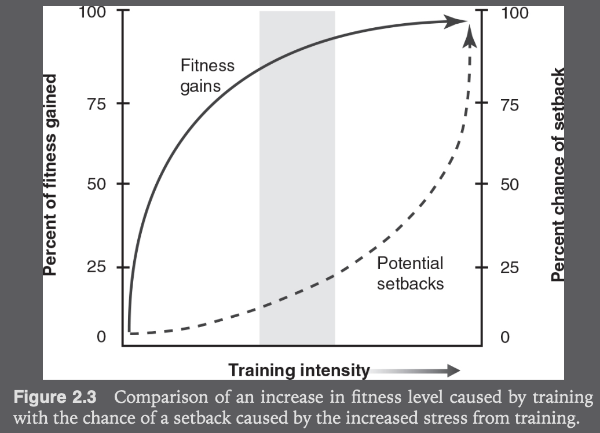
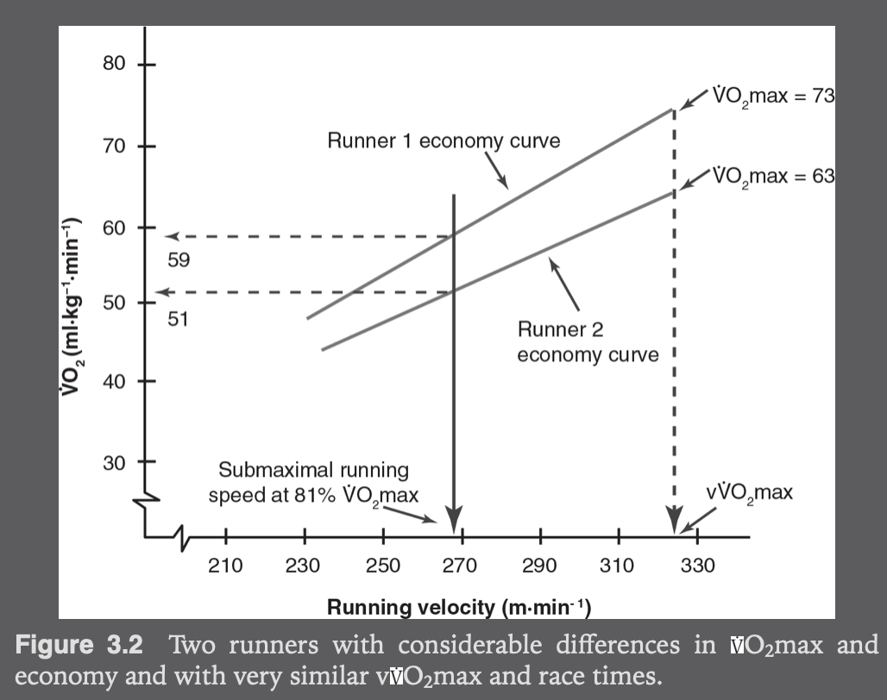
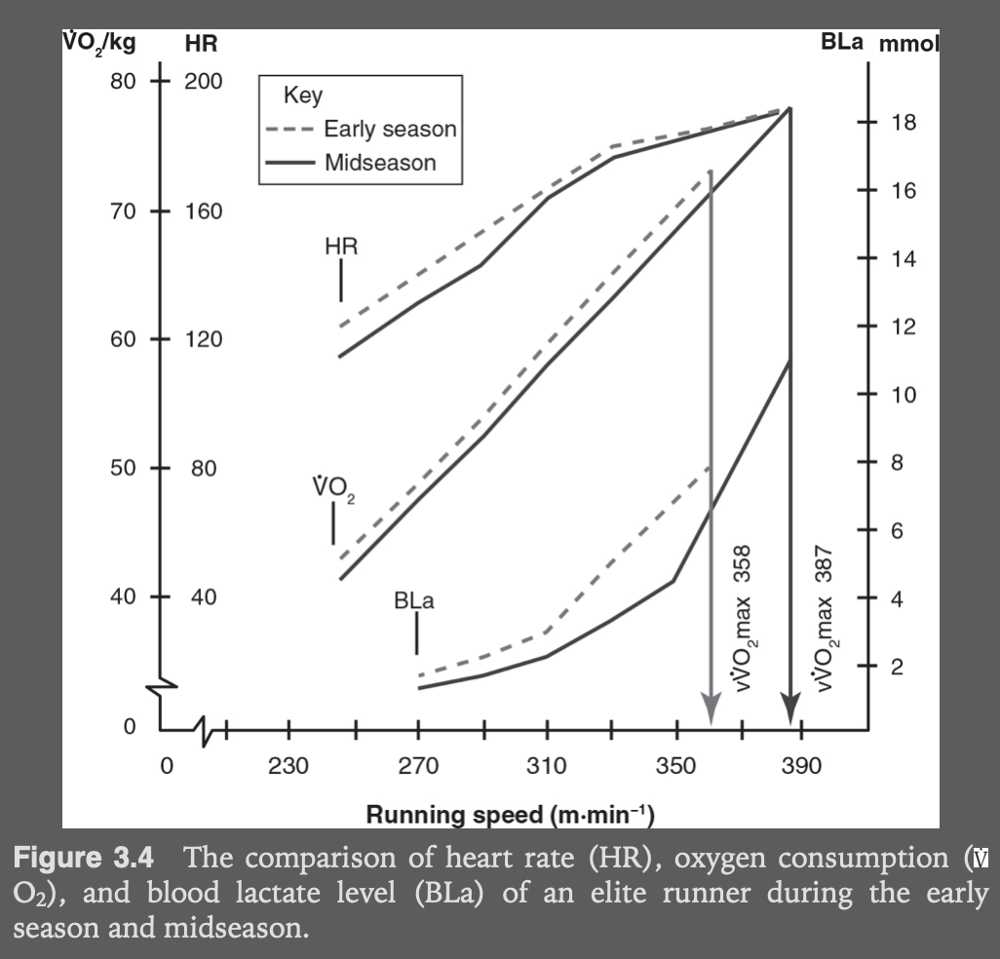
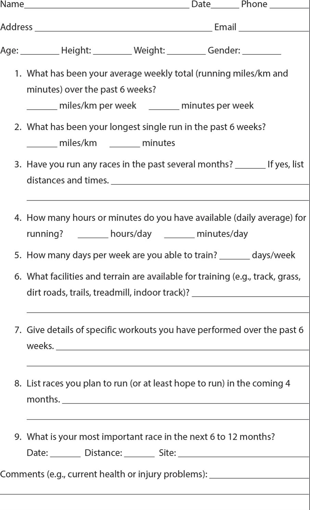
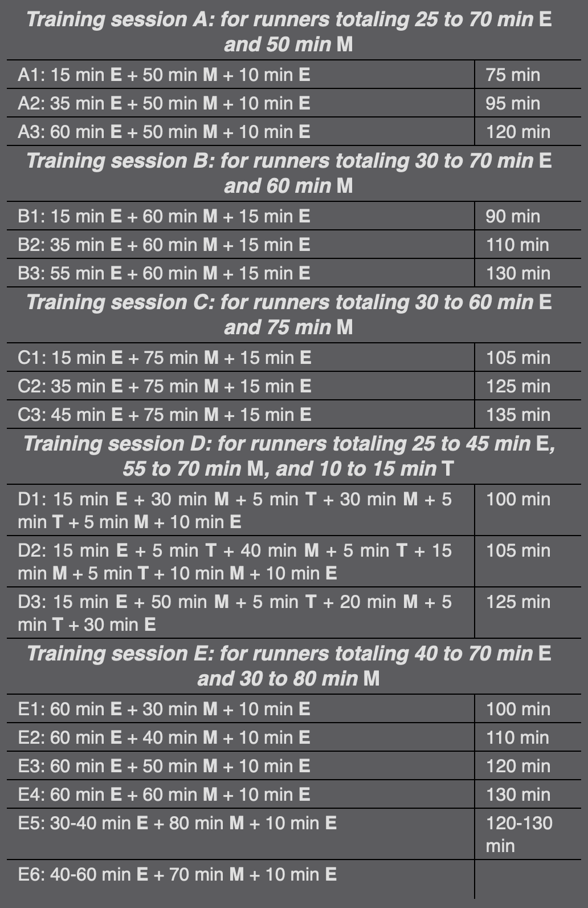
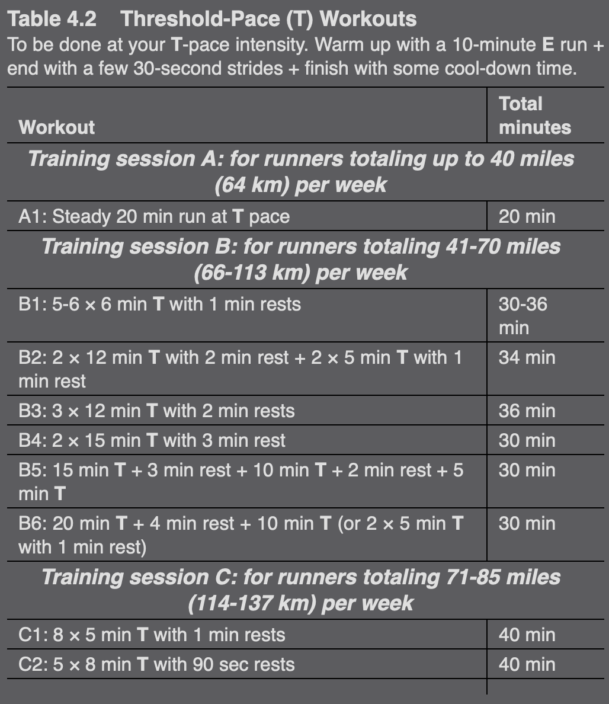
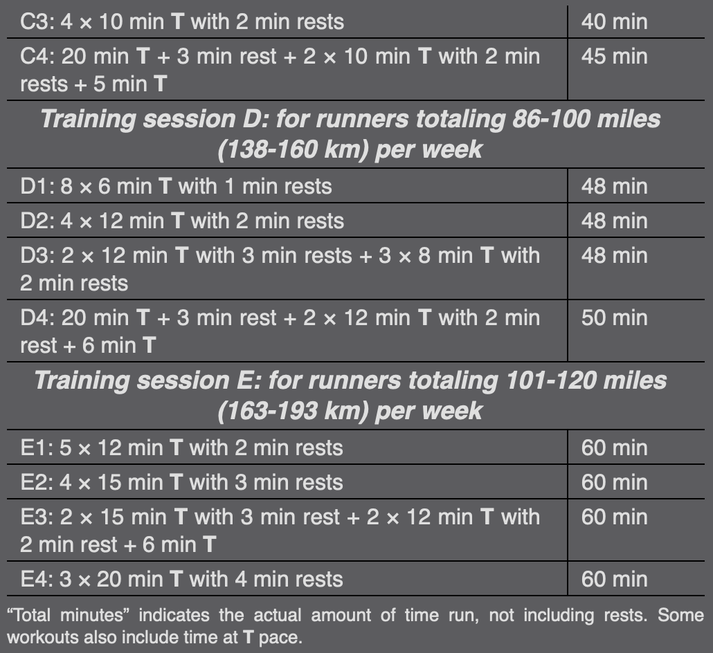
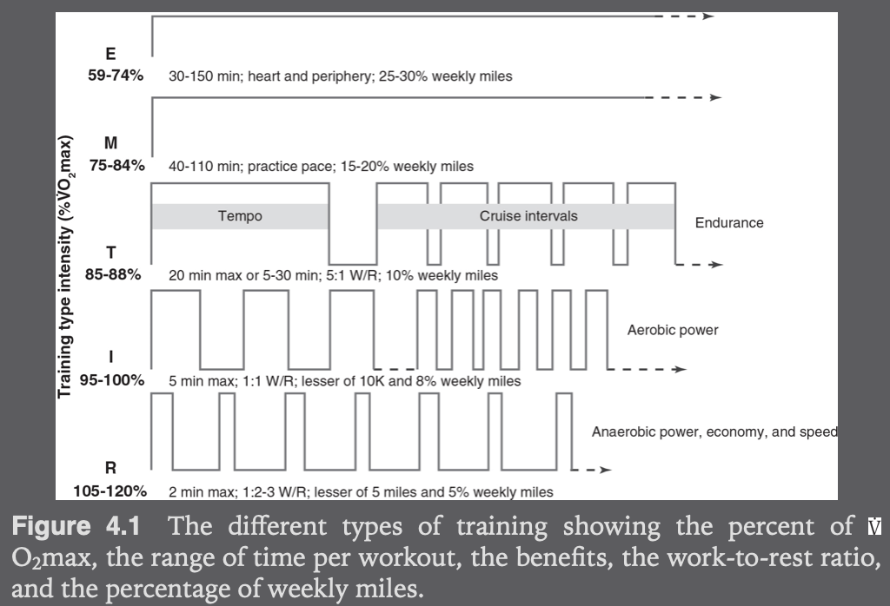

# Category
Sport, practical

# Structure
## Outline
- Preface: approach intro, goals, structure
- Part 1: training information, considerations, and options that can contribute to the success of all runners
- Part 2: training advice and programs specific to different events and distances

# Goals
- Provide practical scientific info for both coaches & athletes
- Present what I think to be the best approach to training for or coaching middle- and long-distance running events

# Terms
- Viscosity: nhầy
- Types of training (increasing level of intensity):
  - E: easy running (or jogging). L run: typically at E pace.
  - M: marathon-pace running: training at the projected marathon race pace
  - T: threshold running
  - I: interval training
  - R: repetition training
- Stroke volume: amount of blood pumped with each heart beat

# Main points
## Preface
- Approach:
  - Consistent training
  - Produce the most benefit from the least amount of stress, not the highest possible amount

## I - Understanding the formula for training
### 1. Essentials of running success
- 4 basic ingredients:
  - Inherent ability: physiologically & biomechanically (eg joint & muscle position, efficiency of the cardiovascular system)
  - Intrinsic motivation
  - Opportunity
  - Direction: coach or teacher or training plan to follow
- Basic laws of running to help evaluate & enhance individually training situations:
  - *Every runner has specific indi abilities:
    - Training time: improve known weaknesses
    - Racing time: take adv of known strengths
  - Find positive in all training sessions
  - Expect variations in performance
  - Be flexible in training to allow for the unexpected (eg unusual weather)
  - Set achievable intermediate goals
  - Focus on the task at hand, don't worry too much about others
  - *Most mistakes in races are made early in the race (eg don't go out too fast)
  - *Training should be rewarding by understanding the purpose of each workout
  - -> Learn sth useful from any race or workout you finish
  - Eat and sleep well consistently
  - Don't train when sick or injured
  - Chronic health issues should be checked by a professional
  - A good run or race is never a fluke: you are capable of doing it
- -> To take adv: memorize & make it a habit

### 2. Training principles and tips
- Can be adjusted
- Each principle improves dif bodily functions
- Principles of training:
  - The body reacts to stress
  - Specificity:
    - Def: the tissues being stresses are the ones that react to that stress
    - 2 types of reactions:
      - Immediate
      - Long term: the parts of the body being stressed become stronger and better prepared to deal with any future stress
  - Overstress:
    - Overstressed body parts may get weaker or break down completely
    - The body accomplish the strengthening part of the stress reaction during recovery or rest time between bouts of stress
    - Reducing stress, physical or psychological, is desirable going into races
  - Training response:
    - Training program benefits usually achieved after 6-8 weeks
    - -> To reach a higher level of fitness, need to increase training stress
    - 4 variables of stress:
      - Workload: distance run
      - Intensity factor: running speed
      - Recovery: time of rest between each run
      - Frequency: eg times per week
    - -> Should change only one of the training variable
  - Personal limits:
    - When an increase in training stress doesn't result in improved fitness
    - Everyone has seasonal limits: due to lifestyle at any given time
    - Training intensities should be determined by current fitness, best measured by race performances
  - Diminishing return:
    - 
  - Accelerating setbacks:
  to avoid setback through injury or lack of interest, most of the training must be in the gray shading in above image
  - Maintenance:
    - Def: it is easier to maintain a level of fitness than to achieve that fitness
    - Partly a psychological matter
    - Imp when planning long-term training program:
    can shift from one type of training to another while still maintaining the benefits of the previous workout
- Training plan development:
  - Be open to trying dif types of training
  - Arrange training in dif orders of imp throughout a season
  - When to increase training stress: always stay at a chosen degree of stress for 6-8 weeks before making changes
- Stride rate:
  - Aim at 180 steps/min to minimize landing shock associate with running
  - Technique:
    - Similar to rolling over the ground, not bounding from foot to foot
    - Avoid placing each foot in front of yourself: ~braking action, increase impact
  - Foot strike:
    - When experiencing calf or shin discomfort, try mid/rear-foot landing technique
    - Avoid turning toes outward upon landing
- Breathing:
  - Reason of harder breathing: increase in CO2 percentage in the lung, not decrease in O2 percentage
  - Breathing rate is typically in rhythm with stride rate
  - Aim for 2-2 breathing rhythm:
    - 2 steps while breathing in & 2 steps while breathing out
    - Most optimal: large amount of air in each breath & large number of breaths
    - Can use 2-1 or 1-2 when working hard (eg last part of 5K or 10K race)
    - -> 2-2 for first 2/3 race, 2/1 for the final 1/3
  - At altitude, faster breathing rate is easier: air less dense -> less air flow resistence
  - Can check breathing rhythm to determine how hard is the training
#### Additional info:
- Muscular discomfort associated with a hard session is realized ~48 hours after the stress

### 3. Physiological & personal training profiles
- Aerobic profile:
  - Economy curve: how much aerobic involvement is associated with increasing workloads
  - 
  - Running economy can vary depending on where you are running (eg at sea level, at altitude, on track, on treadmill)
  - Gender dif: the best men have higher VO2 max values than the best women
- Running variable and improvements:
  - To perform better: improve as many variables as possible. Eg:
    - VO2
    - Heart rate
    - Blood lactate
    - Rating of perceived exertion (RPE): show level of discomfort
  - Improvement due to training:
    - 
- Heart rate during training runs:
  - Slower speed of running under less than desirable conditions will often lead to the desired intensity of exercise
  - Purpose of work out & variable to measure:
    - Spend time at specific speed of running: measure speed
    - Intensity of effort: measure heart rate
  - Maximum heart rate:
    - Vary between indis & between ages
    - How to measure: get max of several efforts: stop when heart rate no longer increases. Types of exercises:
      - Hard 2-min uphill run
      - 800-meter run at solid pace
    - Used to measure training stress
  - Resting heart rate:
    - How to measure: when walking in the morning
    - Used to check:
      - Progress of fitness: lower rate -> stronger heart, increased stroke volume
      - State of over-training: when resting heart rate is considerably higher than normal
  - Hemoglobin content: should not be too low or too high (increase viscosity -> high heart strain & slow circulation)
- Personal training & racing profiles:
  - To set up a training plan that best fits each indi:
  should gather basic info about the past & current state of fitness and time availability
  - 
#### Additional info
- Training intensity is not always the same at the same speed of running. Examples of other factors:
  - Temperate
  - Wind
  - Hilly terrain
  - Rough/muddy footing

### 4. Types of training and intensities
- Easy running:
  - Intensity: 59-74% VO2 max or 65-79% max heart rate
  - Benefits:
    - Psychological: boost confidence when can increase duration
    - Build up a certain degree of resistance to injury
    - Develop of heart muscle: maximum stroke volume is reached at ~60% maximum heart rate
    - Increase vascularization: more tiny blood vessels that feed the exercising muscles
    - Develop muscles involved in running
  - -> Depend on time spent stressing the muscle fibers
  - -> Should spend more time as it is easier to last longer at a comfortable pace
  - When to use:
    - Build a base when:
      - Just starting out in a running program
      - Returning to running after a break of some weeks or months
    - Warming up and cooling down or during recovery jogs between bouts of faster & harder running
  - Training suggestions:
    - Duration:
      - Minimum: 30 mins
      - Maximum: 150 mins
    - Focus on maintain good running mechanics to avoid injury
    - Distance limit for any single run:
      - Weekly mileage < 64km:  <= 30% weekly mileage
      - Weekly mileage >= 64km: the lesser of 25% weekly mileage or 150 mins
- Marathon-pace running:
  - Intensity: 75-84% VO2 max or 80-89% max heart rate
  - Benefits: for someone training for a marathon:
    - Adjust the specific pace to be used in the race
    - Practice drinking at this pace
    - Psychological: gain confidence at the pace you plan to race
  - Training suggestions:
    - Distance limit for any single run: lesser of 110 mins or 29km or 20% weekly mileage
    - Should mix M with both E and T
    - 
- Threshold running:
  - Intensity:
    - Fairly hard but the pace is manageable for a fairly long time: 20-30 mins
    - Peaked and rested, can race for 60 mins
    - You hope the session will end soon
    - 85-88% VO2 max for athletes, 80-86% VO2 max for amateurs, or 88-92% max heart rate
  - Benefits:
    - Improve body's ability to clear blood lactate and keep it below a fairly manageable level
    - Improve endurance: teaching the body to deal with a slightly more demanding pace for a prolonged period of time
  - Training suggestions:
    - 2 types:
      - Tempo run: steady run lasting about 20 mins
      - Cruise intervals: a series of runs at T pace, with a short rest break between the individual runs
      - -> Subjects the body to a longer total time at the desired threshold intensity
    - Cruise intervals:
      - Examples:
        - 5 times 1-mile runs with 1 min rests in between
        - 3 times 2-mile runs with 2 min rests in between
        - Training for marathon: mix some 1-mile runs at T pace in the middle of an M-pace workout (eg table above)
        - -> Prepare for surges or changes in wind or hills in a marathon race
      - Increase stress: reduce recovery time, not increase speed
      - Work-recovery time ratio: 5-1
    - Limit in a single workout:
      - <= 10% weekly mileage
      - Tempo run: 20 mins each, can do more than one
      - Cruise intervals: total 30 mins
    - 
    - 
- Interval training:
  - 
- Summary:
  - 
#### Additional info
- Stay at any amount of weekly time spent running for at least 3-4 weeks before increasing the training amount
- When max for the season, can increase or decrease weekly amounts based on weather or other situations limiting available time
- Should use time, not distance, as the factor limiting types of training

### 6.
- Altitude training: skipped

# Criticism
- Most pictures (except information table) are irrelevant
- Mixing miles and meter is really messy