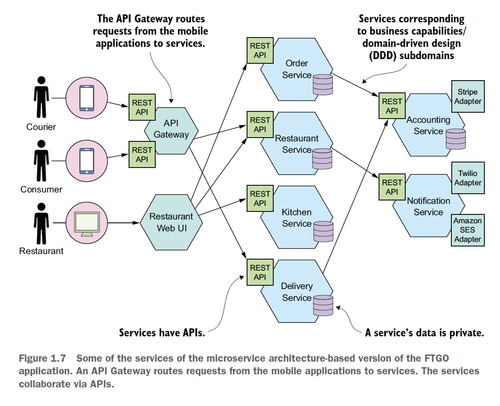
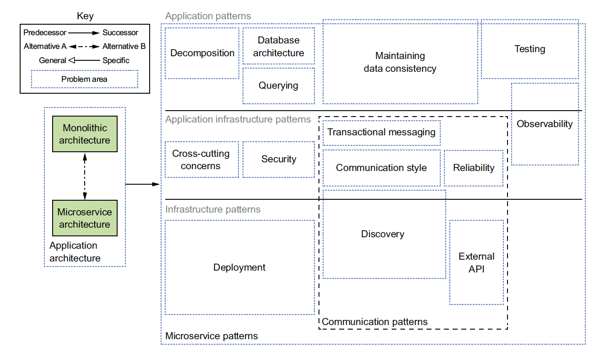
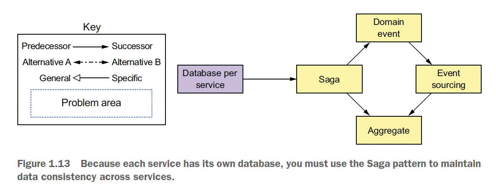
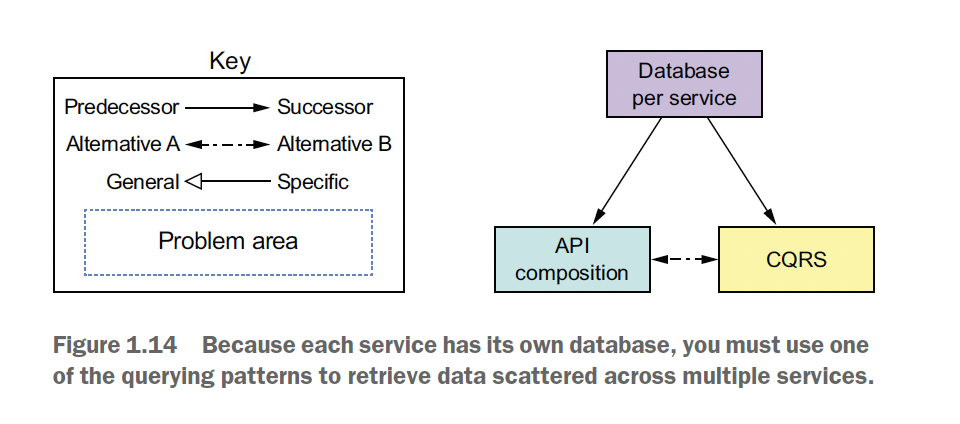
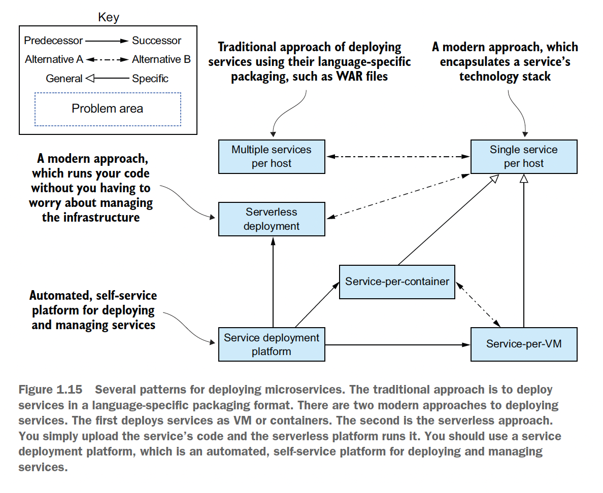

# Category
IT, backend, microservices, architecture, development

# Summary
The author start by introducing the situations and the need to use microservice architecture.
Then he covers the problems you will face when developing microservices and the patterns to solve it.
Last part of the book handles the difficulty when transitioning from monolithic to microservice architecture.

# Structure
- Preface:
  - History of microservice architecture
  - The problems & how they will be addressed in the book
  - Reason to organize the book around patterns
- Chap 1 & 2:
  - Basic concepts
  - Problem of monolithic, when and why to use microservice architecture
  - Advs & disadvs of microservice architecture
  - Microservice patterns as a solution
  - Defining application architecture:
    - Decompose & define services
    - Define APIs
- Chap 3-12: problems & patterns:
  - Interprocess communication
  - Managing transactions
  - Designing business logic
  - Implementing queries
  - Designing external APIs for various types of client
  - Automated testing for microservices
  - Developing production-ready services:
    - Security
    - Configuration
    - Observability
  - Deployment
- Chap 13: refactoring from monolithic to microservice architecture: difficulty & strategies

# Author's problems & solutions
- Discuss benefits & drawbacks of microservices, when to use microservices and when to use monolithic architecture
- Show how to adopt microservice architecture & develop microservices successfully:
  - Effective microservice testing
  - Microservice deployment
  - Refactoring strategies from monolith to microservice
  - How to design a microservice app: solutions to design challenges, including managing distributed data
  - How to develop business logic for a service
- Explain microservice architecture patterns & other concepts
- Make the material accessible regardless technology stack of the reader

# Presentation & style
- Organize around a collection of patterns

# Terms
- List of microservice patterns:
  - Application architecture patterns:
    - Monolithic architecture (40)
    - Microservice architecture (40)
  - Decomposition patterns:
    - Decompose by business capability (51)
    - Decompose by subdomain (54)
  - Messaging style patterns:
    - Messaging (85)
    - Remote procedure invocation (72)
  - Reliable communications patterns:
    - Circuit breaker (78)
  - Service discovery patterns:
    - 3rd party registration (85)
    - Client-side discovery (83)
    - Self-registration (82)
    - Server-side discovery (85)
  - Transactional messaging patterns:
    - Polling publisher (98)
    - Transaction log tailing (99)
    - Transactional outbox (98)
  - Data consistency patterns:
    - Saga (114)
  - Business logic design patterns:
    - Aggregate (150)
    - Domain event (160)
    - Domain model (150)
    - Event sourcing (184)
    - Transaction script (149)
  - Querying patterns:
    - API composition (223)
    - Command query responsibility segregation (228)
  - External API patterns:
    - API gateway (259)
    - Backends for frontends (265)
  - Testing patterns:
    - Consumer-driven contract test (302)
    - Consumer-side contract test (303)
    - Service component test (335)
  - Security patterns:
    - Access token (354)
  - Cross-cutting concerns patterns:
    - Externalized configuration (361)
    - Microservice chassis (379)
  - Observability patterns:
    - Application metrics (373)
    - Audit logging (377)
    - Distributed tracing (370)
    - Exception tracking (376)
    - Health check API (366)
    - Log aggregation (368)
  - Deployment patterns:
    - Deploy a service as a container (393)
    - Deploy a service as a VM (390)
    - Language-specific packaging format (387)
    - Service mesh (380)
    - Serverless deployment (416)
    - Sidecar (410)
  - Refactoring to microservices patterns:
    - Anti-corruption layer (447)
    - Strangler application (432)
- Pattern

# Arguments
## Preface
- Enterprise applications are typically large monoliths (is it?)

## 1. Escaping monolithic hell
- Monolithic architecture
  - Def: structure a system as a single executable or deployable component
  - 
  - Suitable for new, small app
  - Benefits when the app is small:
    - Simple to dev: suitable for IDE & dev tools
    - Easy to make radical changes
    - Easy to test
    - Easy to deploy
    - Easy to scale
  - Drawbacks when the app is big:
    - Too complex -> difficult to dev & debug
    - Dev is slow: lag IDE, slow build, long start up time -> edit, build, run, test loop takes a long time
    - Path from commit to deployment is long:
      - Many devs -> hard to merge & need further testing
      - Complex -> need careful, system testing
    - Difficult to scale: conflicting resource requirements from dif modules
    - Not reliable:
      - Hard to test thoroughly
      - Lack of fault isolation
    - Locked into an obsolete tech stack: rewrite whole app is risky
- Software architecture mainly affect nonfunctional requirements (maintainability, extensibility, testability), not functional requirements
- 3 ways to scale an app:
  - Load balance requests across multiple instances:
    - Randomly
    - Based on request's attribute
  - Decompose by function into multiple services. Can be combined with load balancing.
- Microservice architecture:
  - Def: functionally decompose an app into a set of services
  - 
  - Suitable for large, complex app
  - -> Less about size, more about clear, focused responsibility for each service
  - Characteristics:
    - Loosely coupled services: services as unit of modularity, API as boundary
    - -> Easier to preserve modularity
    - Services communicate via APIs
    - Each service has its own database
  - Benefits: of small, independent services:
    - Enables the continuous delivery and deployment of large, complex apps (most imp benefit):
      - Testability
      - Deployability: usually don't require coordination
      - Autonomous, loosely coupled teams
    - Maintainability
    - Scalability: based on resource requirement of each service
    - Easy to experiment & adopt new techs
    - Reliability:
      - Better fault isolation
      - Easier to test
  - Drawbacks:
    - Difficult to find the right set of services
    - -> Can result in distributed monolith
    - Complex distributed system:
      - IPC
      - Partial failures
      - Transactions & queries spanning multiple services
      - Dev: not supported by IDE, hard to do automated testing multiple services
      - Operational complexity: management & deployment
    - -> Require sophisticated dev & operation skills
    - Need coordination when deploying features spanning many services
    - Difficult to decide when to adopt
  -> Many issues has multiple solutions, each with different set of tradeoffs
- Pattern:
  - Def: reusable solution to a problem that occur in a particular context
  - Describe:
    - Issues
    - Result:
      - Benefit: solved issues
      - Drawback: unsolved issues
      - New issues
    - Related patterns
  - -> Objectivity -> better decision making
  - Can be organized into group: handle problems in a particular area
  - Pattern language: collection of related patterns that solve problems within a particular domain
- Microservice pattern language:
  - Def: collection of interrelated software architecture and design patterns for microservices
  - Software pattern: solves a software architecture or design problem by defining a set of collaborating software elements:
    - Object-oriented pattern: contains collaborating classes
    - High level design pattern: contains collaborating services
  - 3 layers:
    - Infra patterns: solve infra issues outside development
    - App infra patterns: solve infra issues related to development
    - App patterns: solve development problems
  - 
  - Groups:
    - Decomposition:
    - 
    - Communication:
    - 
    - Data consistency:
    - 
    - Data query:
    - 
    - Deployment:
    - 
    - Observability
    - Automated testing
    - Crosscutting concerns
    - Security
- Process & organization:
  - Imp for success, beside architecture
  - 
  - Organization: team of teams, each 8-12 people
    - Each team has clear business-oriented goal:
    developing and possibly operating one or more services that implement a feature or a business capability
    - Cross-functional, can develop, test, and deploy its services without having to frequently communicate or coordinate with other teams
    - Grow: adding teams
  - -> Higher dev velocity, clear point of contact
  - Development & delivery process: agile dev & deployment practices (eg Scrum, Kanban)
  - Transition from monolithic to microservice architecture: need to consider reaction & emotion of people

## 2. Decomposition strategies

# Criticism

# Take away
