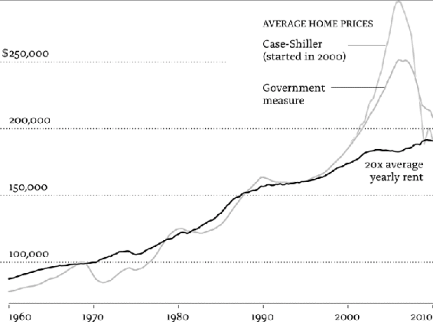

# Category
Behavioral economics, economics. Contains bio, stories & history of behavioral economics.

# Summary
The author tells the history of behavioral economics through his perspective.
Important findings and experiments in the field are described, the difference with formal economic theory are highlighted.
The author also presents its influence on public policy and prediction of future focus in the last part of the book.

# Structure
- Narrative style: ideas come out at dif time/speed
- Both chronological & topical:
  - Part 1 (I): early years & early findings conflicting with formal models
  - Part 2 (II - VI): some topics of behavioral economics:
      - Mental accounting
      - Self-control
      - Fairness
      - Finance
  - Part 3 (VII): recent research endeavors
  - Part 4 (VIII): new challenges & opportunities

# Author problems & solution
- Tell the story about the development of behavioral economics
- Explain some discoveries of the field (in Part 2). Aim:
  - Improve understanding about human behaviors
  - Provide lessons about how to change the way people think about things, especially when they try to maintain the status quo

# Presentation & style
- Narrative style, centered around the development of beha eco, makes the book engaging
- The author has a very good sense of humour

# Terms
- Misbehave
- Constraint optimization
- Rational choice theory
- Rational expectation
- Formal vs behavioral economics
- Opportunity cost
- Endowment effect
- Status quo bias
- Bounded rationality
- Normative vs descriptive (positive) theory
- Weber-Fechner Law
- Acquisition (~ consumer surplus) vs transaction utility
- Sunk cost
- Payment depreciation
- Mental budgeting
- Fungible
- Intertemporal choice
- Consumption function
- Conditional cooperator
- Behavioral vs standard game theory
- Narrow framing
- Equity premium
- Efficient market hypothesis (EMH)
- Value investing
- Present value
- Closed-end fund
- Coarse theorem

# Arguments

## I. Beginning: 1970-78

### 1. Supposedly irrelevant factors (SIF)
- People misbehaving: their behaviors were inconsistent with the idealized model of economic theory
- Problem: the model replace human with Econ
- -> Humans misbehave
- -> Economic models make bad predictions about human behaviors
- -> Can lead to serious consequences
- Core premises of economic theory: optimization & equilibrium:
  - Optimization (rational choice theory):
    - Constraint optimization: people, with limited budget, always pick the best option available
    - Rational expectation: their choices are unbiased (correctly assessing probability)
  - Equilibrium: supply = demand in competitive market
- Flaws of optimization premise:
  - Optimization problems are often too hard for ordinary people to solve: too many options
  - Their choices are biased, overconfident
  - Many factors being left out by the model (eg irrational, psychological)
- -> Need an enriched approach to doing economic research, acknowledging the existence & relevance of humans
- Don't need to throw away everything previously built in economics:
  - Theories based on the assumption that everyone is an Econ:
    - Can be starting points for more realistic models
    - Can be good approximation in special circumstances:
      - Optimization problems to solve are easy
      - Actors in the economy have relevant, highly specialized skills
  - Most market research & analysis:
    - Are done with great care & statistical expertise
    - Doesn't depend on the optimization premise
  - 2 useful research tools:
    - Randomized control trial experiments: what happens when some people receive some "treatment" of interest
    - Naturally occurring experiments/clever economic techniques: detect impact of treatments without conducting designed experiments
  - -> Can learn a lot about the world without imposing optimizing models
  - -> Can provide credible evidence to test optimizing models
- Predictions of economic theory:
  - Safe when it is imprecise: only predict the general direction of the effect
  - Problematic when it is highly specific: depend explicitly on everyone optimizes (being economically sophisticated)
- What to do:
  - Stop assuming abstract models are accurate descriptions of behavior
  - -> Stop basing policy decisions on those flawed analyses
  - Start paying attention to SIF
- Behavioral economics: economics done with strong injections of psychology & other social sciences
- -> More accurate predictions, more fun to learn (lol)
#### Additional info
- The formal models give economics the reputation as the most powerful of the social sciences:
  - Influencing public policy
  - Intellectually: have unified core theory, everything else follows, like physical science
- Recently, behavioral economics & science are being integrated into:
  - Policy-making establishment
  - Businesses

### 2. The endowment effect
- Opportunity cost: what you give up by doing some activity:
  - Formal prediction: people should treat opportunity cost equal to out-of-pocket cost
  - -> Logical thing to do
  - Reality: it hurts more to pay out-of-pocket cost
- -> Endowment effect: people value: things already owned > things available but not yet owned
- Implications: endowment effect + loss aversion -> status quo bias:
  - People stick with what they have, sometimes despite there is a good reason to switch
  - -> Reduced volume of trade in the market
  - Inhibit change

### 3. The list
- Bounded rationality: lack the cognitive ability to solve complex problems
- -> Formal eco handle it by adding error term to the equation
- -> Believe that as long as the errors are random, its opposing effects will cancel each other out
- The errors not random but systematic bias

### 4. Value theory
- Normative vs descriptive theory:
  - Normative: tell the logically consistent way to think about some problem (eg rational choice theory)
  - Descriptive (positive) theory: describe how people actually solve the problem in the real world
- Formal eco use one theory for both normative & descriptive purposes
- Prospect theory (called Value theory in early version):
  - Loss aversion
  - -> Endowment effect
  - Diminishing sensitivity
  - -> Reflect basic human trait: Weber-Fechner Law:
  the just-noticeable difference in any variable is proportional to the magnitude of that variable
  - -> Risk-averse for gains, risk-seeking for losses
  - Focus on changes in wealth instead of levels of wealth
- -> Offer a good prediction of actual choices, not a guide to rational choice
- -> Break away from one-theory approach

### 5. California Dreamin'
- Author decided to use a variety of research methods:
  - Survey
  - Run exp
  - Study real life behavior

### 6. The Gauntlet
- Main reasons economists think they could safely ignore abnormal behaviors:
  - As if:
    - Argument: Even if people are not capable of actually solving the complex problems economists assume they can handle,
    they behave as if they can
    - -> Their actions will approximate those predicted by the theory
    - Should evaluate a theory based on accuracy of its predictions, not realism of its assumption
    - Problems:
      - Systematic bias when choosing an inferior alternative
      - Most people are not experts, they don't behave as if
  - Incentives:
    - Argument: if stakes are raised, people will have greater incentive to do what is necessary to get the problem right
    - -> Can safely ignore experiments with nothing at stake
    - Problems:
      - Unsupported by any evidence
      - Nothing in theory or practice of economics suggest that it only applies to large-stake problems
      - Hiring experts lead to problem of conflict of interest
  - Learning:
    - Argument: experiments are one-shot games. In the real world, people have opportunities to learn.
    - Problems:
      - Learning is difficult in real life: many situations don't:
        - Occur frequently
        - Provide immediate feedback
      - Contradict with incentives argument: small problems occur more frequently than high stake problems
  - Markets: the invisible handwave:
    - Argument:
      1. Markets somehow discipline people who are misbehaving
      2. Market prices can be rational even if individuals misbehave
    - Problems of 1: illogical: market can't transform people/firms into rational agents:
      - In most circumstances, failing to act rationally is not fatal
      - Competitive forces of the market might act slowly
    - Problem of 2: empirical evidences show that market prices are not rational
- -> To answer: need proper data of real people interacting at high stakes in markets, not survey questions
#### Additional info
- Preference reversals: preference is reversed depending on how the problem is framed
- -> Reject a foundation of all formal eco theories: people have well-defined preferences
- -> There is nothing to be optimized without stable preference

## II. Mental accounting: 1979-85
- Def: psychology of spending, saving & other household financial behavior

### 7. Bargains and rip-offs
- Basic economic theory of consumer choice: all economic decisions are made through the lens of opportunity costs:
spend on sth = forgo other opportunities
- -> Need to choose the best possible way to use money
- -> Impossible to consider every way
- Question: when do people consider a cost a loss? Not for routine transactions.
- Acquisition vs transaction utility:
  - Acquisition: bases on standard eco theory, equivalent to consumer surplus, = utility - opportunity cost
  - -> Should be the only consideration for Econ
  - Transaction:
    - Def: perceived quality of the deal, = price actually paid - reference price (price normally expected to pay)
    - Experienced by Human
    - Implication:
      - Can prevent good purchases (the overpriced amount will be forgotten) & induce wasting ones
      - Sellers manipulate perceived reference price. Example: items always on sale: characteristics of marketed goods:
        - Bought infrequently -> don't notice that there is always a sale
        - Quality is difficult to assess -> suggest the quality is high & provide transaction utility
    - Lessons:
      - Consumers: don't buy sth that won't be used just because the deal is too good
      - Business: everyone is interested in a good deal, either via sales or genuine low prices

### 8. Sunk costs
- Def: an amount of money spent and cannot be retrieved
- Consider utility of an activity by: will you do it if it is offered for free?
- Fail to use sth that you paid for = recognize the loss in mental books
- -> The more use, the better the feeling about the transaction
- -> People use as self-control method (eg buy membership to increase exercise)
- -> Effect of sunk costs wears off over time (payment depreciation):
  - Gotten the money's worth
  - Forgotten the original purchase
- When purchase a long time before consuming, people consider it an investment -> later consumption is free
- -> Trick used by some industries (eg wine, vacation property)

### 9. Buckets and budgets
- How families/organizations manage their finances (spending):
  - Use budgets with limit (mental budgeting)
  - Effect:
    - Can serve as a crude way to keep costs under control, while giving discretion to spend within budget
    - Issue: money might not be well-spent:
      - Idle money in a bucket
      - Can't access fund when there is urgent need
      - Try to spend all within the bucket when money is available (eg on expensive things), not transfer to other buckets
  - Violate economic principle: money is fungible (can be spent on anything)
  - -> Should be spent in a way that best serves the interest of the household/organization
- Also apply to wealth: by ease to spend: cash > normal accounts > saving accounts
#### Additional info
- 2008 crisis & relation to mental budgeting:
  - Home equity budget is easy to spend, esp on consumer durables
  - House price boomed -> homeowners borrowed against the increased equity to spend more
  - -> Consumption reduced when bubble busted -> Recession

### 10. At the poker table
- House money effect (dif with prospect theory prediction - risk-averse for gains):
  - Winning money is assigned to a different account & get spent easier via risk-seeking behaviors
  - Thinking that worst case is back at the starting point
  - Effect: financial bubbles: made money -> invest in more in stock (more risk)
- Break-even effect (dif with prospect theory prediction - risk-seeking for losses):
  - When there is a chance to break even: a loss doesn't generate risk-taking preferences
  - When there is a chance: take risk
  - Effect: traders take increasing risks in the last quarter when losing, hoping to break even
  - -> Should pay attention to employees who are losing money
#### Additional info
- Author's observation: poker players dislike big bet that might increase size of their losses substantially
- -> Opt for small bets that offer small chance of a big win, even though they have lower chance of breaking even

## III. Self control: 1975-88
- Def: what people want might not be what people choose
- More generally: choosing between now and later
- In formal eco theory, there is no difference between what people want and what people choose: choices reveal preferences
- -> No self-control problem

### 11. Willpower? No problem
- Passion vs (impartial spectator): myopic - short-sighted
- Preference for present consumption over future consumption diminishes overtime
- Intertemporal choice: choice made about the timing of consumption
- Formal model of intertemporal choice (by Paul Samuelson): discounted utility model with exponential discounting:
  - Consumption worth more now than later
  - Exponential discounting: discounted at a fixed annual rate
  - Limitation: if people discount the future at rates that vary over time, then they may not behave consistently (showing time-inconsistent preferences)
- Implication: underlies consumption function: how spending of a household varies with income:
  - Keynes model:
    - Household will consume a fixed proportion of extra income
    - Proportions vary across socioeconomic classes: poorer -> higher
  - Friedman model: permanent income hypothesis: spread the extra income over next 3 years
  - Modigliani model: smooth consumption over lifetime, including retirement & bequests
- -> Econs think further ahead & have more will power to delay consumption
- -> As models evolved (economists became more mathematically sophisticated), the people they described evolved as well
- Behavioral theory to consumption & saving: behavioral life-cycle hypothesis:
a household consumption in a given year depends on both its lifetime wealth & the mental accounts where that wealth is held
#### Additional info
- Original "invisible hand" phrase used by Adam Smith: "led by an invisible hand to promote and end which was no part of his intention.
Nor is it always the worse for the society what it was no part of it."
- -> Not that things will turn out for the best
- Smith writing regarding behavioral eco: in "Theory of moral sentiments"

### 12. The planner and the doer
- When to take action to restrict future choices & commit to planned course of action:
you believe that if you change preferences later, the change will be a mistake
- Strategies people use to deal with self-control problems:
  - Commitment strategy:
    - Limit their own choices
    - Remove the cues that would lead to temptation
  - Raise the cost of submitting to temptation
  - Make bet with themselves: I won't do sth until finish some task
- Role of awareness:
  - Not aware: no strategy
  - Aware:
    - Underestimate severity of self-control problem: rely mostly on will-power
    - Not underestimate: establish rules & strategies
- Self-control is about conflict
- -> Model with 2 conflicting selves (based on principal-agent model):
  - Planner:
    - Try to maximize total utility of all does
    - Have limited control over actions of doers
    - Influence doers' actions by:
      - Use rewards/penalties (eg guilt) that still allow doers' discretion
      - Impose rules (eg mental accounting) to limit doers' options:
        - Better choice since guilt makes life less pleasurable & requires will-power
        - Might not always be available
        - Might be inflexible: can't anticipate all situations
    - -> Make doers act more like Econ
  - Doers:
    - Short-lived agents, change after some time period
    - Completely selfish, try to maximize its own utility
#### Additional info
- Principal-agent model:
  - Principal:
    - Def: boss/owner
    - Monitoring every action of the agent is too costly
  - Agent:
    - Def: someone whom authority is delegated
    - Know sth the principal does not
    - Aim: make as much money as possible while minimizing effort
  - Solution: use a rules and procedures to minimize the costs of conflicts of interest. Example:
    - Account expenses
    - Pay mostly by commission
- Other model to explain self-control problem: beta-delta model:
  - Now: full utility
  - Any time period far enough away to be considered later: half utility, no discounting

## Interlude
### 13. Misbehaving in the real world
- Skiing resort: selling discounted 10-pack ticket:
  - Transaction utility
  - Decoupled purchase decision from decision to go skiing -> initial purchase is considered an investment
  - Sunk cost: customers might bring others without prepaid ticket with them when trying to make up for the cost
  - Hedge against warm winter without snow
- Reducing price only makes sense when:
  - Increase current sale
  - Increase future sale by building customer loyalty
- Sale small % < Rebate (returning some money) - dif mental account < reducing car loan interest (10 -> 2.9%) - reducing 2/3 rate sound like a lot

## IV. Working with Danny: 1984-85
### 14. What seems fair
- Formal eco theory prediction when demand increase: raise price
- -> Who value it most should get it
- Perception of fairness depends on :
  - Whom the action helps or harms
  - How it is framed:
    - Highest price intended to charge as regular price, deviation as discount -> fair
    - Raising price: unfair, unless to cover increased cost
  - -> People feel entitled to current status quo (reference point)
- Implication for firms (esp those need customers' loyalty):
  - Don't charge what has been given away for free
  - Increase is ok if:
    - All competitors follow (customer has no choice)
    - The products usually depends on supply and demand: should still have a cap

### 15. Fairness game
- Ultimatum:
  - People dislike unfair offers & willing to take financial hit to punish the Proposers
  - People usually feel morally obliged to make fair offers
- -> Dif with game theory prediction: accepting any amount offered
- Prisoner's Dilemma: people coordinate 40-50% instead of detect all the time (game theory prediction)
- -> Implication: public good problem:
  - Formal eco prediction: undersupply because there is no incentive
  - -> Gov must step in
  - Reality & in experiment:
    - People are conditional cooperators: cooperate if enough others do (~The selfish genes)
    - Cooperation can be maintained in repeated games if players are given opportunity to punish non-cooperators

### 16. Mugs
(combine with notes of chap 2)

## V. Engaging with the economics profession
### 17. The debate begins
- Rationality is neither necessary nor sufficient to do good economic theory:
  - Necessary: many rigorous formal theories based on behavior that is not rational
  - Sufficient: need auxiliary assumptions to derive useful result
- Inconsistency in theorists' behavior: take months to derive the optimal solution, then assume that agents are capable of solving it
- Efficient market models are only special cases, not realistic
#### Additional info
- Thomas Kuhn's model of scientific revolutions:
paradigms change only when a significant number of empirical anomalies are accepted as valid violations of the received wisdom
- -> People break with the way the field has been progressing & pursue a new direction

### 18. Anomalies
- Author's goal to create paradigm shift:
  - Find a broad spectrum of anomalies:
  - Use a variety of empirical methods, including market data
  - Not necessarily with a satisfactory behavioral explanation: only need to contradict theoretical predictions
#### Additional info
- Return on betting on favourites is much better than betting on longshots, esp in the last race (break even effect)

### 19. Forming a team
- Behavioral economics common method: not collaborate with psychologists, but read psychology work then research independently
- -> Not discover new psychology, only modify economics tools to accommodate Humans & Econs
#### Additional info
- Behavioral vs standard game theory: 
  - Behavioral: how people actually play games
  - Standard: how Econs would play games if they knew that everyone else playing was also an Econ
- Why interdisciplinary meetings, esp those with high level agendas, are usually disappointing:
academics don't like to talk about research in the abstract, but people from other fields find technical details hard to understand,
or consider some theoretical exercises pointless

### 20. Narrow framing on the upper east side
- Narrow framing: treating events one at a time, rather than as a portfolio
- Implications:
  - Decision-making:
    - Managerial decision-making is driven by 2 biases:
      - Bold forecast: caused by inside view
      - Timid choice: caused by loss aversion, exacerbated by rewards & punishment system
      - -> Managers avoid losses that can be attributed to them
    - In many situations, the agents make poor choices because of the failure to create an env in which:
    the agents can feel that they can take good risks and not be punished if the risks fail to pay off
    - -> The principal are to be blamed because they narrow-frame, not the agents
  - Investment:
    - Equity premium: differences in returns between equities (stocks) and risk-free asset (eg short-term gov bonds)
    - Why equity premium is much higher than the increase in risk: people take short-term view of their investments
    - -> The more people look at their portfolios, the less willing they will be to take on risk (see more losses) (also in Fooled by randomness)
    - Advice: buy a diversified portfolio heavily tilted toward stocks, then avoid reading news

## VI. Finance
### 21. The beauty contest
- Efficient market hypothesis (EMH): 2 components:
  - Prices are rational: event if some people made mistakes, smart people could trade against them & correct prices
  - -> All assets sell for its true intrinsic value. Hold for both individual securities & overall market.
  - -> There is no bubbles
  - Beating the market is impossible: all publicly available information is reflected in current prices
  - -> Can't predict future prices & make a profit
- Keynes's view on finance:
  - As the shares are sold to the public, the owners know less about their true value
  - Role of emotions: day to day fluctuations play an excessive influence on the market
  - Rationality of price:
    - The pros are more likely to ride the wave than to fight it
    - Cause: better to fail conventionally than to succeed unconventionally
  - -> Investors will try to buy stocks that will go up in value - stocks that they think other investors will later decide should be worth more
  - -> Bet on future valuations
#### Additional info
- Keynes macroeco argument: gov should use fiscal policy to stimulate demand during recessions/depressions

### 22. Does the stock market overreact?
- Trading volume in security market is very high compared to prediction made by rational theory
- -> Possible explanation: overconfidence
- People make extreme forecasts based on low-quality data
- -> Extrapolate recent past into the future
- Explanation for why value trading works:
  - People overreact to recent performance of stock
  - Regression toward the mean
- -> Contradict with efficient market hypothesis prediction: P/E ratio & past history of the stock returns are known
#### Additional info
- Graham's value investing: find stocks priced below their intrinsic, long-run value: one strategy:
  - Calculate P/E ratio: price per share/annual earnings per share
  - Buy stock with low P/E of the big companies
  - Warning: under-valuations/over-valuations may persist for a long time

### 23. The reaction to overreaction
- How formal theorist explain why value investing beats the market:
value stock has higher risk -> higher earning = risk premium
- -> But value stock was in fact had lower risk according to formal risk model (CAPM)

### 24. The price is not right
- Present value of all future dividend payments should determine stock price
- -> Stock price = forecast of present value
- Rational forecast principle: predictions cannot vary more than the thing being forecast
- Present value are stable, but stock prices are highly variable
- -> Prices are not rational
- Robert Shiller's method to beat market & predict bubbles: compare overall P/E ratio with average historical ratio (eg 10 years):
  - Long-term stock market price/earning ratios:
  - 
  - House prices and rents:
  - 
- -> Can predict trend but not precise timing: bubble can persist for years
- -> Can't be used to time the market

### 25. The battle of closed-end funds
- Closed-end fund: after initial raise, money can't be invested into or withdraw from
- Shares are sold by closed-end fund at different price from market price
- -> Violation of one-price principle of EMH
- Strategy by Graham: buy funds with the biggest discounts

### 26. Fruit flies, icebergs, and negative stock prices
- Conclusions about EMH:
  - Good normative theory
  - As a descriptive theory:
    - Can't beat market: mostly true:
      - Most active money managers can't beat the market
      - Sometimes wrong price can stay wrong or get even more wrong -> can't execute smart trade
    - Price is right (more imp component of the theory): price is often wrong, sometimes very wrong
    - -> Misallocation of resources can be big, bubbles are possible
    - -> Need proper policy to guard against
#### Additional info
- How Long term capital management (LTCM) fund collapsed:
  - Noticed that Royal Dutch Shell share price is not right -> do smart trade
  - Lost in other trade -> tried to reduce positions
  - Other funds also lost money & also bought Shell shares -> also did the same
- -> Price was not correct but got more wrong -> collapsed

## VII. Welcome to Chicago: 1995-present
### 27. Law schooling
- Traditional law & economics approach: based exclusively on models of Econ:
things would turn out for the best if markets were left alone to sort things out
- -> Arguments depend on invisible handwave
- Idea: modify those arguments by introducing core elements of beha eco:
  - Bounded rationality
  - Bounded willpower
  - Bounded self-interest
- Core principle of libertarian beliefs: consumer sovereignty:
  people make good choices, better than anyone else could make for them
- -> If people make mistake due to bounded rationality & self-control -> can help them make better choice
- Gov bureaucrat is also Human, subject to bias
- Coarse theorem:
  - Theory: in the absence of transaction costs, resources will flow to their highest value use
  - Implication: when judges decide who owns a certain right, if transaction costs are low,
  the decision won't determine what economic activities will take place, only who has to pay
  - Problems:
    - Transaction costs might be considerable
    - Sometimes trade won't happen even if transaction costs are zero due to:
      - Endowment effect -> how resources are allocated initially matters
      - Fairness: willing to walk away from an unfair offer
      - -> People can punish the other party, even at cost to themselves

# Criticism

# Take away

# Notes
- Mistake when skimming this book:
  - Didn't read conclusion
  - Didn't read bibliography (dif from index)
- This summary focus on the findings of beha eco, not history of the field